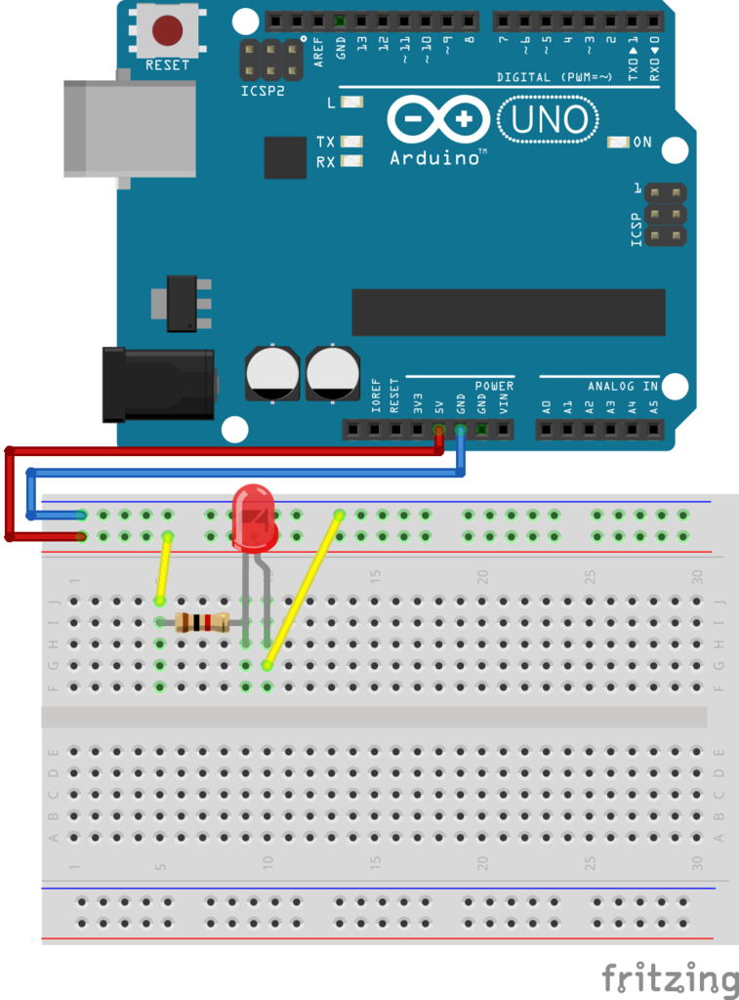
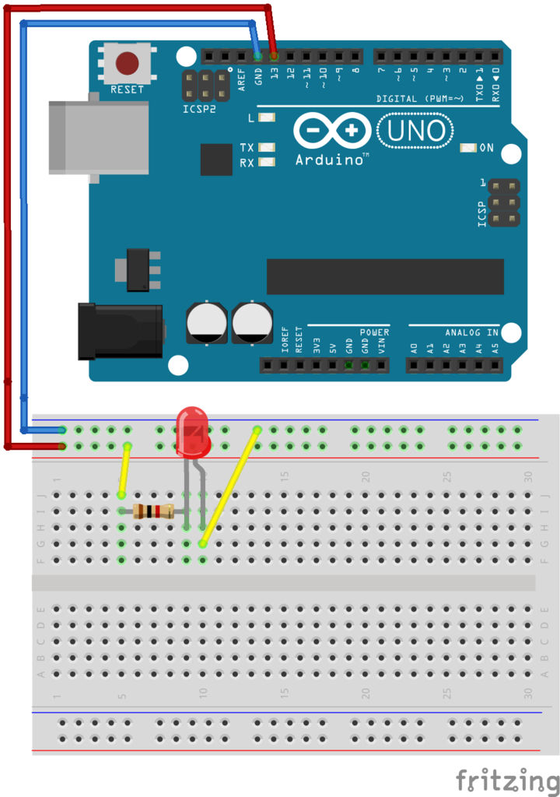
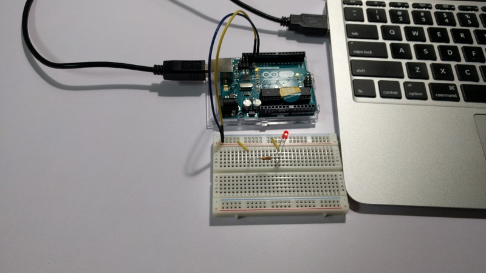

とりあえず初歩の初歩、LED を光らせます。

まずは Arduino の単純な電源出力(5V, 3.3V)を利用します。

## 通常点灯回路

5V 出力から LED と抵抗に繋げるだけですね。接続にはジャンパ線を利用します。  
LED には向きがあるので注意。(長いのが+)  
今回は 1kΩ を使いました。



写真はないですが光りました。よかった。

## L チカ回路

LED を点滅させます。  
今回はデジタル 13 番ピンを使います。



## コード

当然プログラムも書きます。  
Arduino はユーザが多く、サンプルコードやリファレンスなど簡単に手に入れられるのが良いですね。

```c
int LED = 13;

void setup()
{
  //13番ピンを出力に利用
  pinMode(LED, OUTPUT);
}
void roop()
{
  //13番ピンをオン
  digitalWrite(LED, HIGH);
  //500ミリ秒待つ
  delay(500);
  //13番ピンをオフ
  digitalWrite(LED, LOW);
  delay(500);
}
```

## 完成

光りました。やりました。



予想よりも手軽で簡単に始めることができて驚いています。  
ただし、この L チカで満足してしまう人も多いらしいですね。

私は今のところモチベがあるので大丈夫そうですが...
