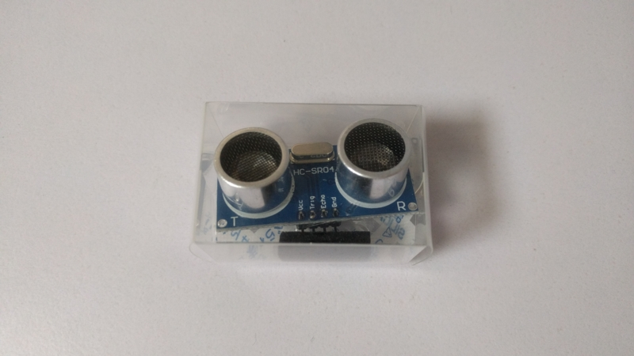
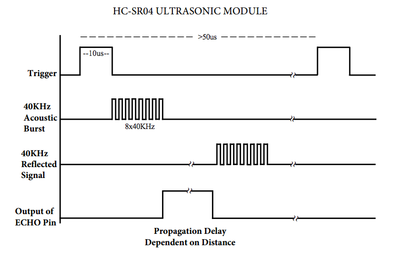
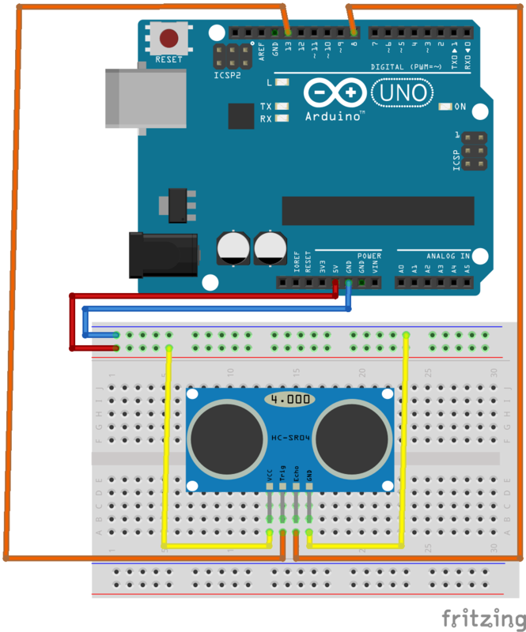
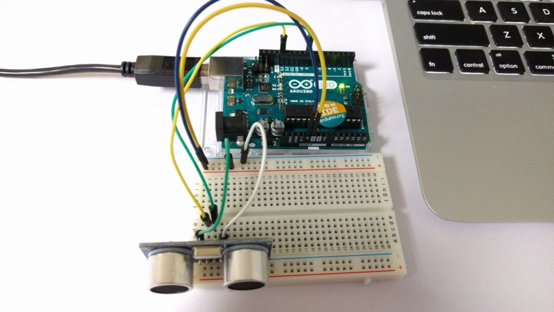
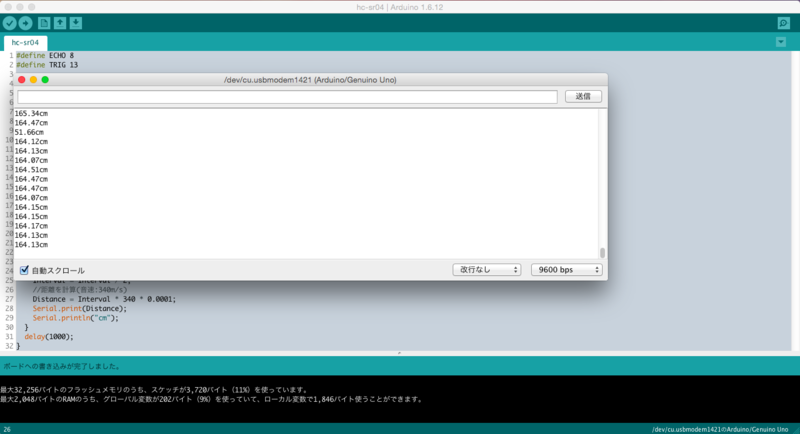

何かの距離を測りたいって時、あると思います。

Arduino では簡単に距離センサも利用できると聞いたので試してみました。

購入したのは HC-SR04、一般的な超音波距離センサです。



## 回路

データシートによると trigger を 10μs HIGH にすることで超音波が放出され、反射して戻るまで echo が HIGH になるみたいですね。  
その echo の時間を利用して距離を計測します。  
[データシート](http://akizukidenshi.com/download/ds/sainsmar/hc-sr04_ultrasonic_module_user_guidejohn.pdf)



それをもとにするとこんな感じになりました。  
どうすればかっこよく書けるんでしょうかね。



写真だとこちら。



## コード

上述したセンサの仕様からコーディングします。

```c
#define ECHO 8
#define TRIG 13

void setup()
{
  pinMode(ECHO, INPUT);
  pinMode(TRIG, OUTPUT);
  Serial.begin( 9600 );
}
void loop()
{
  double Interval = 0; //受信間隔
  double Distance = 0; //距離

  digitalWrite(TRIG, HIGH);
  delayMicroseconds(10);
  digitalWrite(TRIG, LOW);
  //ECHOピンがLOWになるまでの時間を取得
  //タイムアウトで0が返る
  Interval = pulseIn(ECHO, HIGH);

  if (Interval != 0)
  {
    //片道
    Interval = Interval / 2;
    //距離を計算(音速:340m/s)
    Distance = Interval * 340 * 0.0001;
    Serial.print(Distance);
    Serial.println("cm");
  }
  delay(1000);
}
```

## 完成

結果をシリアルで出力しているため、  
ツール > シリアルモニタ で確認します。



容易に実装できましたね。今後定番の自走カーを作る時などに利用したいです。

音速には温度が影響するため、そちらも考慮するとより精度が上がるようです。
