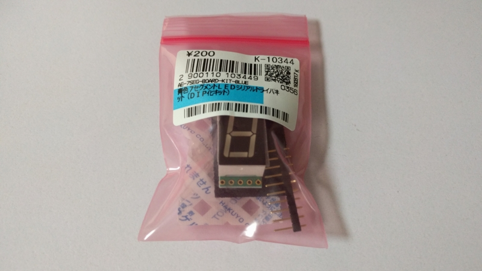
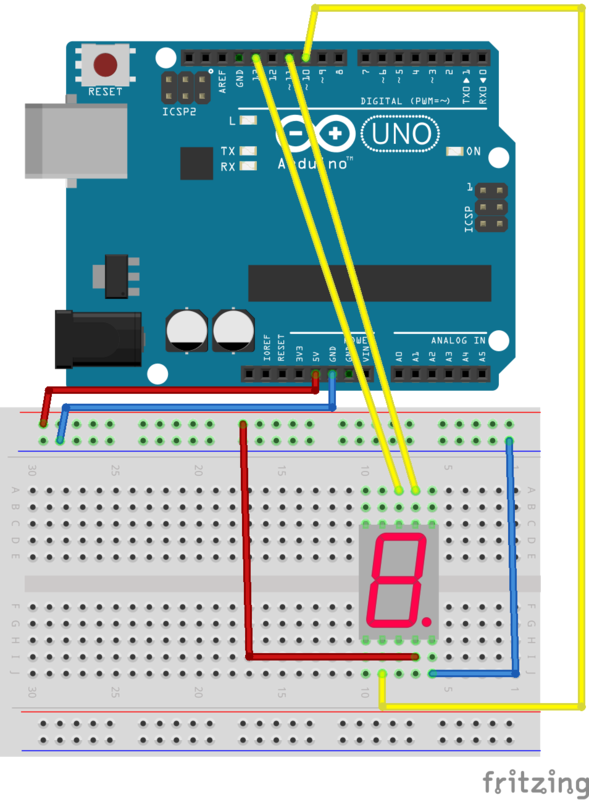
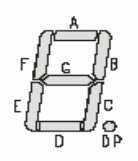
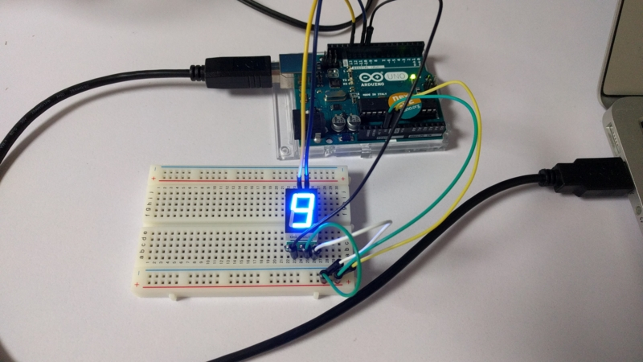

Arduino は取得したデータをシリアルモニタなどで確認することができますが、その場ですぐ知りたい時に 7 セグは便利ですね。

ということで秋月電子で購入しました。



[akizukidenshi.com](http://akizukidenshi.com/catalog/g/gK-10344/)

7 セグ LED とシリアル通信可能なドライバが付属したキットということではんだ付けが必要です。  
初めてのはんだ付け、楽しいけど難しかったです。

## 回路

説明書は[こちら(秋月電子)](http://akizukidenshi.com/download/ds/akizuki/AE-7SEG-BOARD_a2.pdf)  
説明書ではセグを 2 つ使っていますが、1 つの場合はこんな感じになります。



少しピンがたくさんあって複雑そうですね。ちなみに光量は減りますが、5V 電源と GND を繋げなくても光りました。

## コード

秋月電子のサンプルコードを参考にしました。

```c
#include<SPI.h>

int sck = 13;
int latch = 10;
int sdi = 11;
int d_time = 300;
const byte digits[] =
  {
    0b11111100, // 0
    0b01100000, // 1
    0b11011010, // 2
    0b11110010, // 3
    0b01100110, // 4
    0b10110110, // 5
    0b10111110, // 6
    0b11100000, // 7
    0b11111110, // 8
    0b11110110, // 9
  };

void setup()
{
  pinMode(latch,INPUT);
  pinMode(sck, OUTPUT);
  pinMode(sdi, OUTPUT);
  //SPI通信の準備
  SPI.begin();
  //ビットオーダを指定します(LSBFIRST or MSBFIRST)
  SPI.setBitOrder(LSBFIRST);
  //データモードの設定
  SPI.setDataMode(0);
}

void loop()
{
  //digits分ループさせます
    for (int i = 0; i < 10; i ++)
    {
      //latchのON OFFで更新します
      digitalWrite(latch, 0);
      //引数をSPIで送信します
      SPI.transfer (digits[i]);
      digitalWrite(latch, 1);
      //一定時間待つ = 表示時間
      delay(d_time);
    }
}
```

byte 配列は A,B,C,D,E,F,G,DP の順になっています。(例:0b11111100 で 0 に見える)  
詳しくは LED 部の[仕様書](http://akizukidenshi.com/download/OSL10561-LRA.pdf)に乗ってます。(リンクは赤月電子)



11 ピンと 13 ピンは使用していないのに繋げているように見えますが、Arduino UNO での SPI 通信では  
10 ピン:SS  
11 ピン:MOSI(SDI)  
12 ピン:MISO  
13 ピン SCK  
となっているため必要です。

### ビットオーダーの指定

```c
  SPI.setBitOrder(LSBFIRST);
```

LSBFIRST と MSBFIRST があります。  
SPI で送信する配列の順番であり、ABCDE の配列があったとき、  
LSBFIRST なら ABCDE  
MSBFIRST なら EDCBA  
の順番で処理します。

### データモードの指定

```c
  SPI.setDataMode(0);
```

SPI のアイドリング状態と処理タイミングを決めます。

| SPI_MODE | アイドリング | 処理タイミング |
| :------: | :----------: | :------------: |
|    0     |     Low      |   立ち上がり   |
|    1     |     Low      |   立ち下がり   |
|    2     |     High     |   立ち下がり   |
|    3     |     High     |   立ち上がり   |

### SPI 送受信

```c
 SPI.transfer (digits[i]);
```

1 バイトの引数を送信します。

## 完成

うまくいくと数字が表示されます。  
0-9 を順番にひたすらループします。



7 セグ LED だけだと回路が複雑になりますが、シリアル通信を行うことでシンプルに実装できました。
