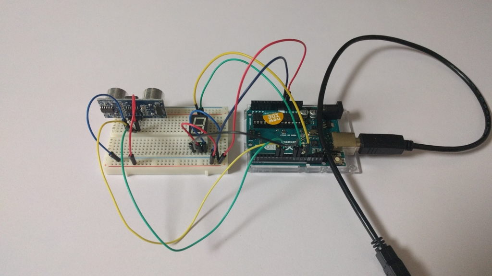
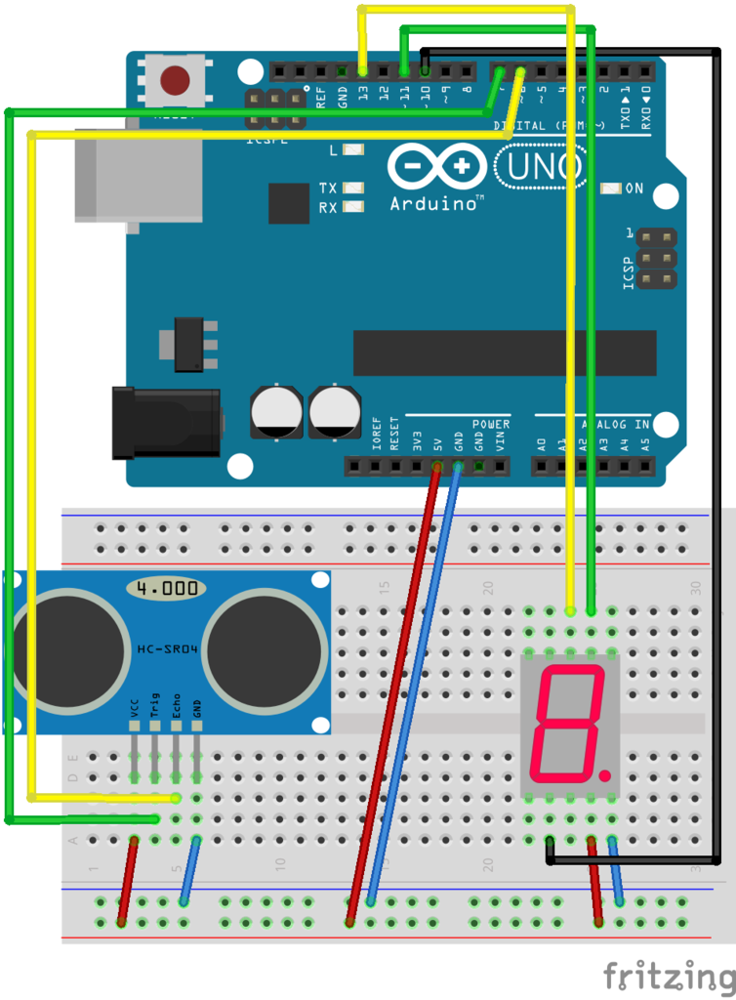
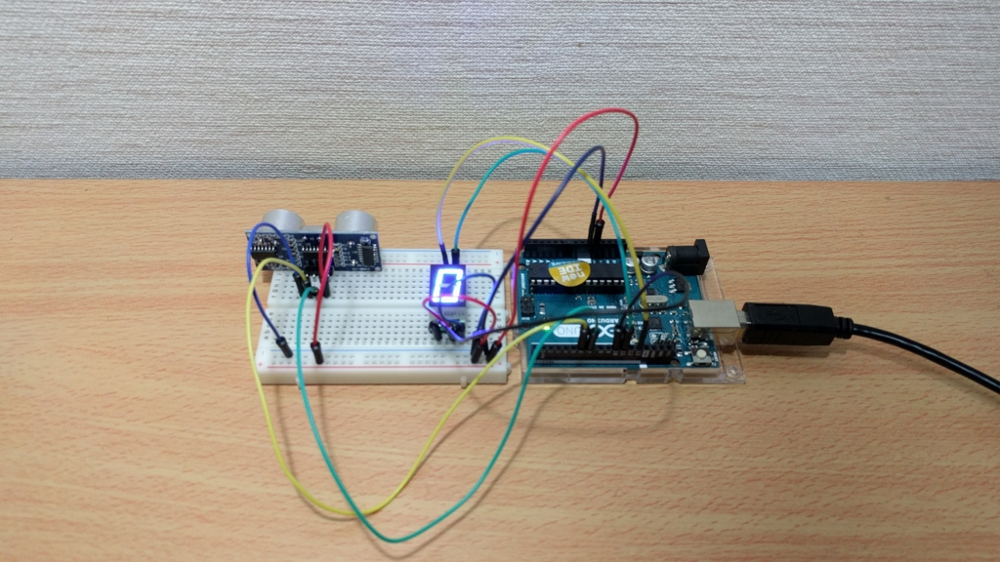
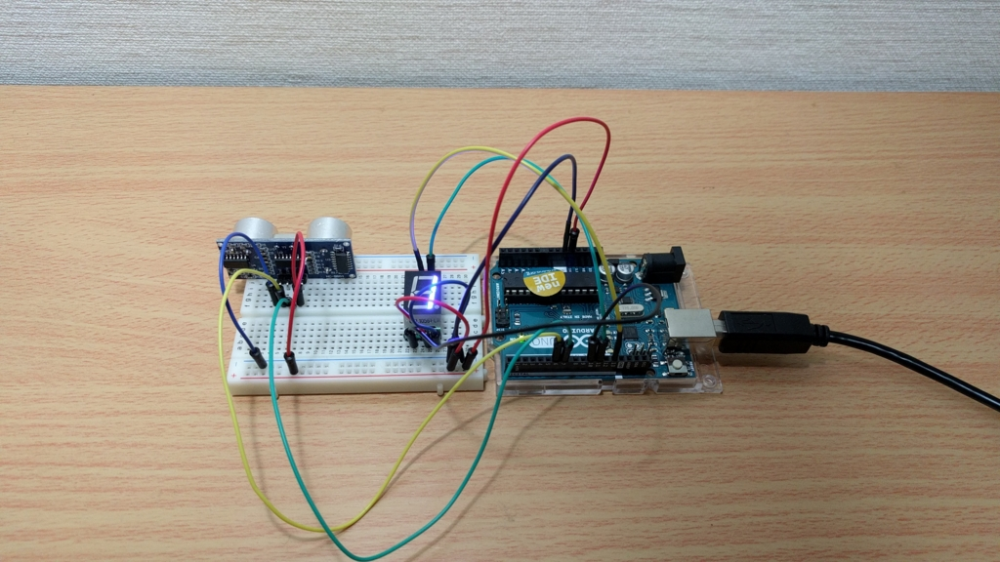
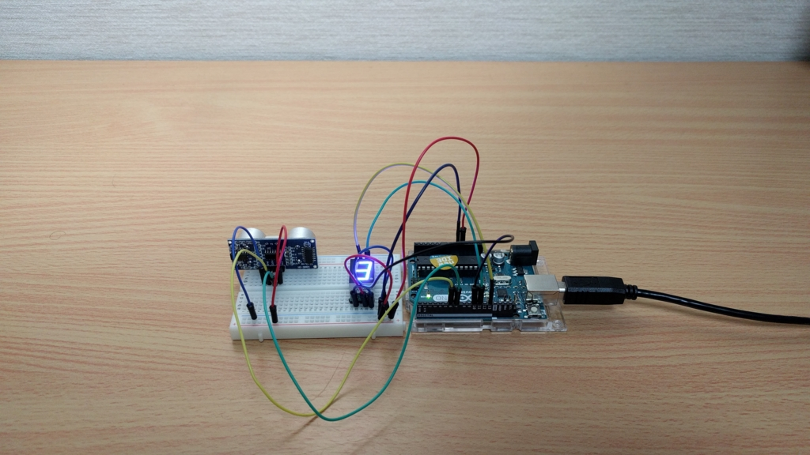

以前試した超音波距離センサと 7 セグを利用して簡易超音波式メジャーを作成しました。



基本的に組み合わせるだけですので、追加の部品などは不要です。

## 回路

隣に繋げるだけです。



## コード

```c
#include<SPI.h>

#define ECHO 6
#define TRIG 7

#define SCK 13
#define LATCH 10
#define SDI 11

const byte digits[] =
  {
    0b11111100, // 0
    0b01100000, // 1
    0b11011010, // 2
    0b11110010, // 3
    0b01100110, // 4
    0b10110110, // 5
    0b10111110, // 6
    0b11100000, // 7
    0b11111110, // 8
    0b11110110, // 9
  };

void setup()
{
  //hc-sr04
  pinMode(ECHO, INPUT);
  pinMode(TRIG, OUTPUT);
  Serial.begin( 9600 );
  //7seg
  pinMode(LATCH,INPUT);
  pinMode(SCK, OUTPUT);
  pinMode(SDI, OUTPUT);
  SPI.begin();
  SPI.setBitOrder(LSBFIRST);
  SPI.setDataMode(0);
}

void loop()
{
  double Interval = 0;
  double Distance = 0;

  digitalWrite(TRIG, HIGH);
  delayMicroseconds(10);
  digitalWrite(TRIG, LOW);
  Interval = pulseIn(ECHO, HIGH);

  if (Interval != 0)
  {
    Interval = Interval / 2;
    Distance = Interval * 340 * 0.0001;
    Serial.print(Distance);
    Serial.println("cm");
  }

  //7seg
  int d_seg = 0;
  if(Distance < 10.0)
    {
      d_seg = 0;
    }
  else if(90.0 < Distance)
    {
      d_seg = 9;
    }
  else
    {
      d_seg = Distance / 10;
    }

  digitalWrite(LATCH, 0);
  SPI.transfer (digits[d_seg]);
  digitalWrite(LATCH, 1);

  delay(500);
}
```

### 7 セグが表示する値

1 桁しか表示できないので、一定の範囲で変動するようにしました。

測定距離 < 10cm  
→0

10cm < 測定距離  
→10 の位

90cm < 測定距離  
→9

## 完成

10cm 未満



15cm くらい



30cm くらい


