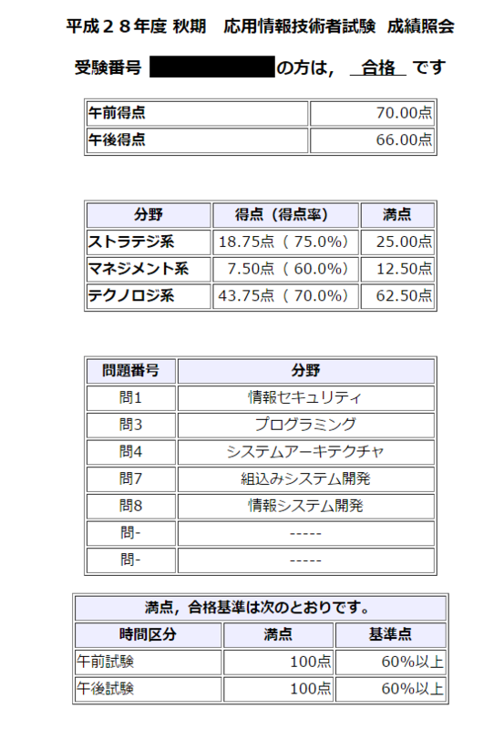

2016 年秋季の試験にて、応用情報処理技術者試験に一発合格することができました。  
勉強法などを参考にしていただけたら幸いです。

## なぜ受けたのか/メリット

### "情報技術についてはある程度知っているよ" と示せる

応用情報技術者試験の対象者は下記のように定義されています。

> 高度 IT 人材となるために必要な応用的知識・技能をもち、高度 IT 人材としての方向性を確立した者

つまり合格すれば、国が上記を証明してくれるのです。

### 知識の幅が広がる

IT といってもたくさんの意味を含みます。  
アルゴリズム、ソフト、ハード、セキュリティ、マネジメント、法務、、、

応用情報はそれらほぼ全ての分野から出題されます。

試験に合格するための勉強を行うだけでも、幅広い知識を得ることができます。

### 会社から金一封もらえるから

ちょっとしたボーナス。これが主な目的かもしれない。

## 勉強時間 午前

### 1 ヶ月弱前~1 週間前

平日は仕事帰りに喫茶店で 2-3 時間ほど参考書で勉強しました。  
その際ペンをほとんど使わず、計算問題も解法だけ答え合わせを行い、解説が少ない用語を見つけたら理解するまでスマホで確認という形式をとりました。  
そうすることでいいペースで参考書を進めることができたと思います。

土日は平日勉強したとき苦手と感じた分野の復習を行いました。

その際使用した参考書はこちらです。 [徹底攻略 応用情報技術者教科書](https://www.amazon.co.jp/dp/484433722X)

数年ぐらい誤差ですので、心理的抵抗がなければ中古品でも十分だと思います。

なお私はすでに基本情報を取得していたため、いきなり応用情報から受ける場合はもう少し余裕を持ったスケジュールにすべきかと思います。

### 1 週間前

午前問題は過去問から出題されていることが多いため、ネットの過去問集サイトを利用してひたすら過去問を解きました。

[応用情報技術者過去問道場｜応用情報技術者試験.com](http://www.ap-siken.com/apkakomon.php)

これだけでかなり安定して点を取れるようになったと思います。

## 勉強時間 午後

2~3 日前になんとなく過去問を眺め、当日選ぶ問題を考えていました。  
正直午前が不安で午後に時間を割けられなかったからです。

とはいっても、**午前問題さえ解ける力を持っていれば午後問題の多くは"国語"に変化します。**問題文をよく読めばわかることが多いです。

また、プログラミングを少しでも触ったことがあればプログラミングの問題はおすすめです。比較的安定して点が取れます。

## 感想

メリットにも書きましたが、知識の幅が広がったことが一番嬉しいです。  
今までなんとなくで理解していたものを正しい知識で修正することで IT に関してより興味が湧き、さらには自信にもつながりました。

ちなみに応用情報技術者試験に合格すると、2 年間は高度情報処理技術者試験の午前 I が免除されます。
