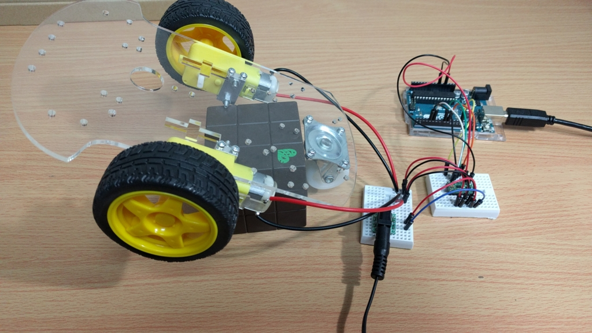
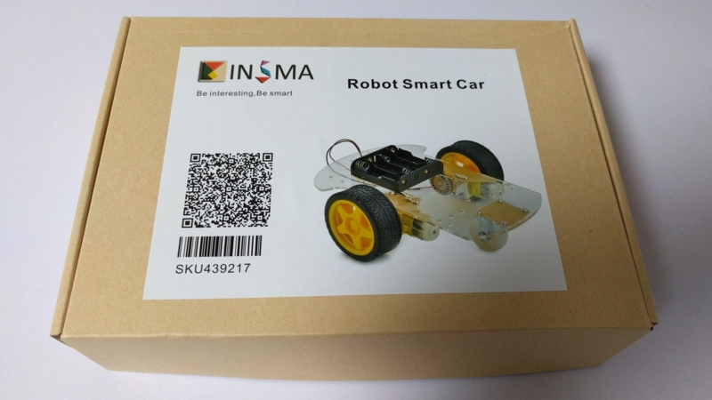
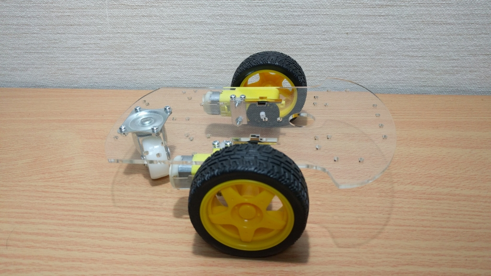
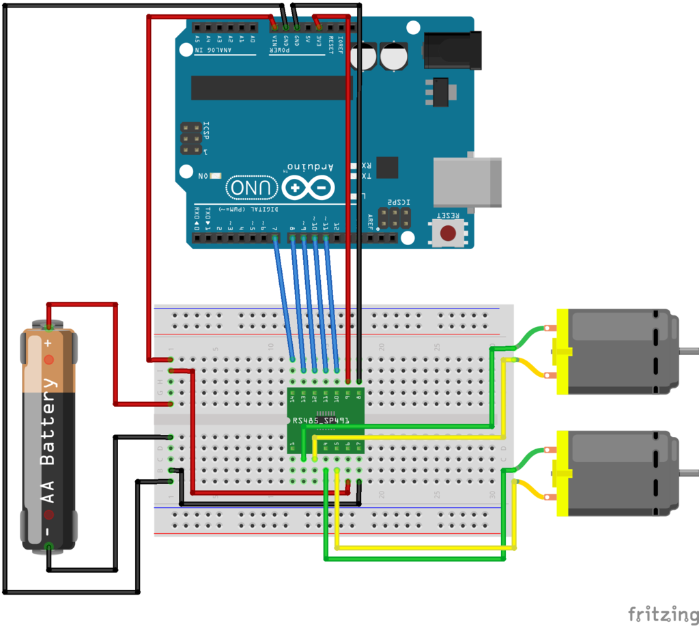
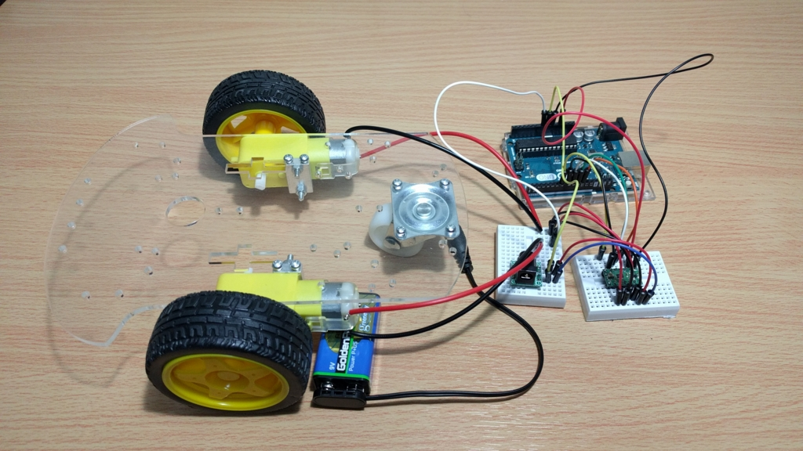

大きく動くものが作りたいということで、自立走行車を作りました。  
とりあえず今回はモータの制御だけです。



## 必要なもの

- Aruduino UNO
- 適当なシャーシ
- デュアルモータドライバ DRV8835
- ブレッドボードやケーブルなど

## シャーシ作成

Amazon のレビューが若干怪しいシャーシですが、値段の割にしっかりしてました。





## 回路

DRV8835 の仕様は以下販売サイトの説明がわかりやすいと思います。  
[Pololu - DRV8835 Dual Motor Driver Carrier](https://www.pololu.com/product/2135/)

今回はシンプルに制御したかったので、MODE に HIGH を入力しました。

| xPHASE | xENABLE | xOUT1 | xOUT2 |        処理        |
| :----: | :-----: | :---: | :---: | :----------------: |
|   0    |   PWM   |  PWM  |   L   | 前進 PWM%/ブレーキ |
|   1    |   PWM   |   L   |  PWM  | 後進 PWM%/ブレーキ |
|   x    |    0    |   L   |   L   |  ショートブレーキ  |

それを元に回路を組みます。fritzing にモータドライバのパーツがなかったので、それっぽいもので代用しました。

電源を Arduino の Vin に繋げることでモータと Arduino の電源をまとめることができます。(許容電圧には気をつけて下さい)



## コード

### ストップアンドゴー

```c

#define MODE 7
#define APHASE 8
#define AENBL 9
#define BPHASE 10
#define BENBL 11

void setup()
{
  pinMode(MODE, OUTPUT);
  pinMode(APHASE, OUTPUT);
  pinMode(AENBL, OUTPUT);
  pinMode(BPHASE, OUTPUT);
  pinMode(BENBL, OUTPUT);
  digitalWrite(MODE, HIGH);
}

void loop()
{
  digitalWrite(APHASE, LOW);
  analogWrite(AENBL, 50);

  delay(2000);

  digitalWrite(APHASE, LOW);
  digitalWrite(AENBL, LOW);

  digitalWrite(BPHASE, LOW);
  analogWrite(BENBL, 255);

  delay(2000);

  digitalWrite(BPHASE, LOW);
  digitalWrite(BENBL, LOW);
}
```

基本的に[Pololu - DRV8835 Dual Motor Driver Carrier](https://www.pololu.com/product/2135/)の仕様に従えば動きます。  
速度は"analogWrite"で決定します。

### 徐々に速度変化

```c
#define MODE 7
#define APHASE 8
#define AENBL 9
#define BPHASE 10
#define BENBL 11

void setup()
{
  pinMode(MODE, OUTPUT);
  pinMode(APHASE, OUTPUT);
  pinMode(AENBL, OUTPUT);
  pinMode(BPHASE, OUTPUT);
  pinMode(BENBL, OUTPUT);
  digitalWrite(MODE, HIGH);
}

void loop()
{
  for(int i = 50; i < 255; i++)
    {
      digitalWrite(APHASE, LOW);
      analogWrite(AENBL, i);
      digitalWrite(BPHASE, LOW);
      analogWrite(BENBL, i);
      delay(100);
    }
  delay(2000);
    for(int i = 255; i > 50; i--)
    {
      digitalWrite(APHASE, LOW);
      analogWrite(AENBL, i);
      digitalWrite(BPHASE, LOW);
      analogWrite(BENBL, i);
      delay(100);
    }
    delay(2000);
}
```

## 完成

とりあえずタイヤの制御部を完成させることができました。  
次回はこれらをシールド化してシャーシに載せます。


