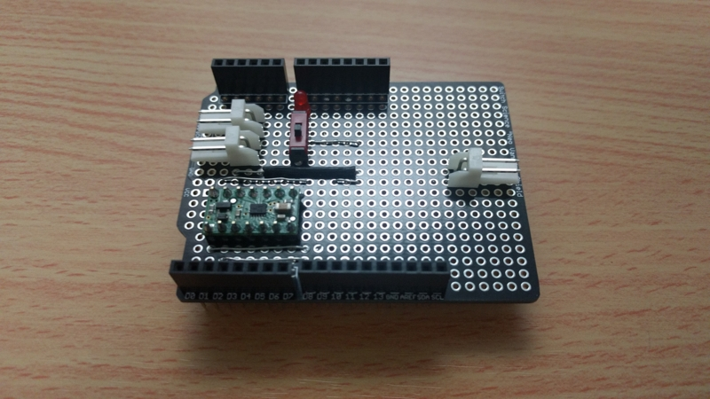

前回はブレッドボードでモータ制御を実装することができました。

そのまま車体に乗っけてもいいのですが、利便性を考えてシールド化しました。

## 必要なもの

- バニラシールド
- 配線やソケットなど

## 配線

ブレッドボードではジャンパ線を利用して自由度の高い配線ができましたが、自作シールドではそうもいきません。

交差しないようにとか、近くに集まりすぎないようにとか、いろいろ考慮が必要です。そのため、紙などで一旦配置を考えることをお勧めします。私は結局色々妥協しました。

 

写真で見ると分かるかと思いますが、いくつかブレッドボード版から改良しています。  
まず Arduino への電源供給をするかしないか選択できるスイッチを追加し、さらにモータと電源の接続を EI コネクタにすることで再利用性を高めました。  
ブレッドボード図にすると以下のようになります。

## 完成

Arduino に電源供給するとエネループ電池 x4 では足りなかったため、9V 電池を利用しています。今後はその辺も計算しないといけませんね。

とりあえず仮載せです。見た目がスッキリしましたね。

