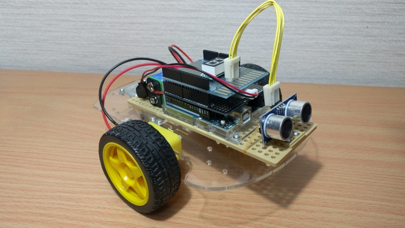
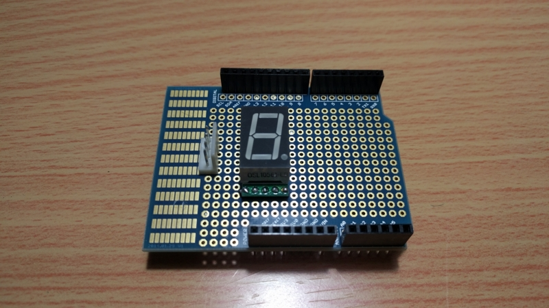
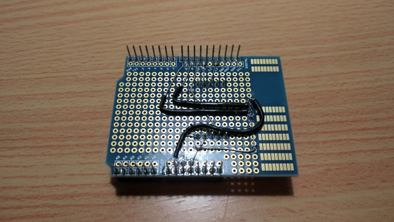
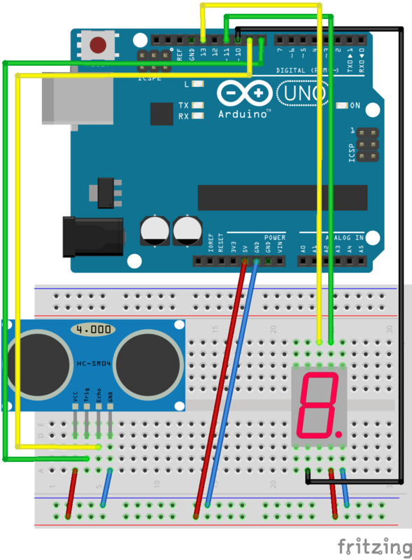
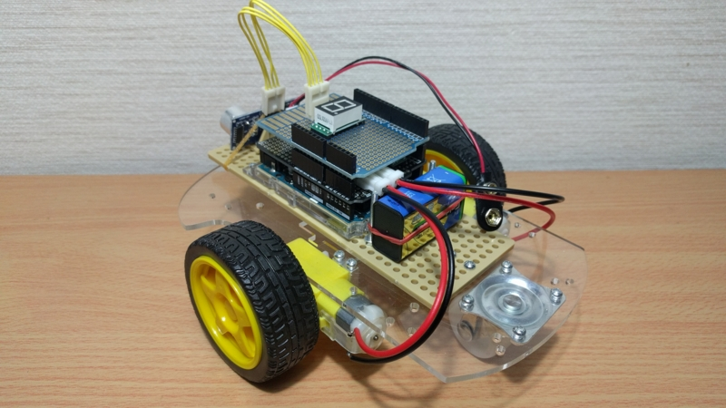

前回でモータ制御だけ可能な自立走行車ができました。

しかしこれだけでは事前に与えられたルートでしか制御を行うことができません。  
そこで今回は距離センサのシールドを作成し、障害物で自動停止する機能を実装できました。

## 必要なもの

- バニラシールド
- 配線やピンなど

また、シャーシの連携性が悪かったためにタミヤのユニバーサルプレートを追加購入しています。  
初めからタミヤのキットを買っておけばよかったと後悔してます。

## 配線

基本的には過去記事で作成したものをそのままシールドに移すだけですが、モータドライバとの組み合わせの関係で使用ピンを若干変更しました。

部品量が少ないからと事前に検討せず適当に半田付けしていったら、裏がひどいことになりましたね。

ブレッドボードにするとこんな感じです。

## コード

シールドが 2 枚になったことでコードが若干長くなってしまいましたが、難しく考える必要はなく、ブレッドボード時のコードをほぼそのまま流用できます。

とりあえず今回はシンプルに障害物で止まるコードを試します。

## 完成

できたシールドを上に乗っけるだけです。だいぶいい感じになりましたね。

