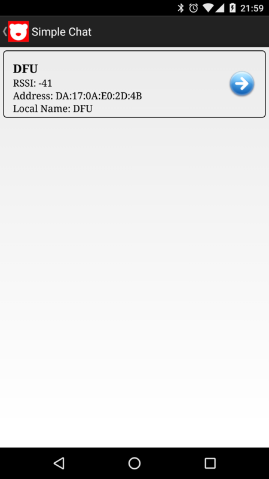

ある日突然 BLE したくなったので買いました。

## これが BLE Nano です


小さいです。


下の USB 部は書き込み用です。上に乗っているさらにちっさいのが本体です。


こんな感じで書き込みます。


## BLE Nano へプログラミングする方法

以下の方法があります。

### mbed

オンラインコンパイラを利用したプログラミングです。オンラインでバイナリデータを作って放り込めば完成らしい。

今回は ARM CPU への開発になるので、本来ならこれが自然ですね。

### Arduino

慣れているので今回はこっちでいきます。ただなんだかんだ mbed と同じようなコードになるみたいです。

### Keil / GCC

BLE Nano での使い方は調べていません。

## 実験

BLE Nano のサイトは以下になりますが、Arduino プログラミングに関しては RedBearLab nrf51822 のリファレンスへ誘導されます。  
[http://redbearlab.com/blenano/](http://redbearlab.com/blenano/)

以下のサイトが RedBearLab nrf51822 用です。同じ nrf51822 を使っているので内容は同じなんでしょうね。ややこしいですが、nrf51822 は ARM の BLE 内蔵 CPU チップで RedBearLab nrf51822 はその開発用ボードです。  
[http://redbearlab.com/getting-started-nrf51822](http://redbearlab.com/getting-started-nrf51822)

### 準備

まずは Arduino IDE に BLE Nano を対応させるために以下 GitHub/README の指示に従います。  
[GitHub - RedBearLab/nRF51822-Arduino: Moved to https://github.com/redbear/nRF5x](https://github.com/RedBearLab/nRF51822-Arduino)

Arduino IDE を開き、 `Setting` > `ボードマネージャの追加` に下記を追加します。

```
https://redbearlab.github.io/arduino/package_redbearlab_index.json
```

すると `Tools` -> `Board` -> `Boards Manager ...` に RedBear が表示されるのでインストールします。


続いて BLE Nano に bootloader を書き込みます。

bootloader フォルダ以下にある"bootloader.hex"を書き込み機のマウント名"MBED" か "DAPLINK"直下にコピーしてください。

しばらくすると BLE Nano が再起動しますので、再マウントされたフォルダに fail がなければ成功です。

### サンプルファイルの書き込み

Arduino IDE のツールから書き込み設定を BLE Nano 用に選択します。

- ボードを BLE Nano(新旧あるので注意)
- 書込装置を MBED or DAPLINK

Arduino IDE の「ファイル > スケッチの例 > Digital > Blink without Delay」で試しに書き込んでみましょう。

BLE Nano の裏面 LED が点滅するようになったら成功です。

### BLE を試す

せっかくなので BLE の機能も試しましょう。  
「スケッチの例 > BLE_Example > SimpleChat」を書き込みます。

今回は Android と通信を行うため google play store からアプリを落とします。  
対応バージョンは 4.3 以上で、かつ端末が BLE に対応している必要があります。  
[https://play.google.com/store/apps/details?id=com.redbear.redbearbleclient](https://play.google.com/store/apps/details?id=com.redbear.redbearbleclient)[play.google.com](https://play.google.com/store/apps/details?id=com.redbear.redbearbleclient)

iOS はこちらです。  
https://itunes.apple.com/app/ble-controller/id855062200

Arduino IDE でシリアルモニタも開いておきます。

まずはアプリのメニューからで Simple Chat を選択し、検索で出てきた BLE Nano を選択します。



続いてアプリ側からメッセージを送ってみます。


上手くいくとシリアルモニタに文字列が表示されます。


今度は逆にシリアルモニタからメッセージを送ってみます。


上手くいくとアプリ側にも文字列が表示されます。


とりあえず動作検証を終えることができました。
