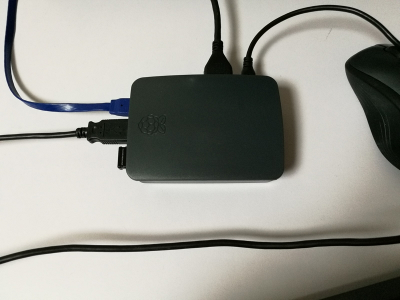

買いました。ラズベリーパイ。


いっしょにいろいろな物も買いました。


## 初期設定

簡単に紹介します。

今回は NOOBS を利用して OS を書き込みます。

### NOOBS をダウンロード

NOOBS を使うと非常に簡単に OS のインストールができます。

以下サイトから zip or torrent でダウンロードします。

LITE は軽いですが、OS が入ってないです。  
Raspbian を利用するなら、結局後でラズパイ側からダウンロードが必要になるので通常版です。[www.raspberrypi.org](https://www.raspberrypi.org/downloads/noobs/)

### SD の準備

microSD をディスクユーティリティでフォーマットします。ついでに名前も変えておきます。windows なら適当なソフトでフォーマットしてください。


### コピー

解凍したファイルを SD カードにコピーします。


### 起動

先にキーボードとマウスと繋げておきましょう。ネット回線は有線で繋げました。



電源を繋げると起動し、こんな画面になります。ならなかったら何かがおかしいです。


### インストール

いろいろありますが、Raspbian with PIXEL を選択してインストールします。windows10 Iot とか結構気になるところ。


終わると再起動し、GUI で表示されます。


### ユーザー設定

#### 1. ユーザの追加

初期ユーザの pi のままでもいいですが、みんなが知っているユーザでセキュリティ的にも良くなさげなので新規ユーザで作り直しましょう。

```
# sudo adduser [newuser]
```

パスワードを二回入力し、後はエンター連打でオッケー。

#### 2. グループに追加

groups で pi のグループを確認します。

```
# groups pi
pi : pi,adm,.....,gpio
```

それを新規ユーザにも追加します。

```
sudo usermod -G pi,adm,.....,gpio [新しいユーザ]
```

#### 3. 初期ユーザ pi を削除

初期ユーザは不要になるので消します。GUI モードだと currently used by process となって消せない時があるので、simple console モードにしてから消しましょう。

以下コマンドから設定を開き、Boot Options で console モード(自動ログインなし)を選択します。

```
# sudo raspi-config
```

再起動して新規ユーザにてログイン後、以下にて削除します。

```
sudo userdel -r pi
```

GUI を使わない人なら Console モードのままでいいですね。

戻すならまた raspi-config で。

### emacs

ファイル編集用に emacs を入れておきます。vim は使いません。

```
sudo apt-get install emacs
```

#### capslock

キーボードの capsLock を Ctrl に変えます。

下記ファイルを

```
/etc/default/keyboard
```

こうします。

```
XKBOPTIONS="ctrl:nocaps"
```

#### アップデート

後はソフトウェアのアップデートしておきましょう。

```
sudo apt-get update
sudo apt-get upgrade
```
