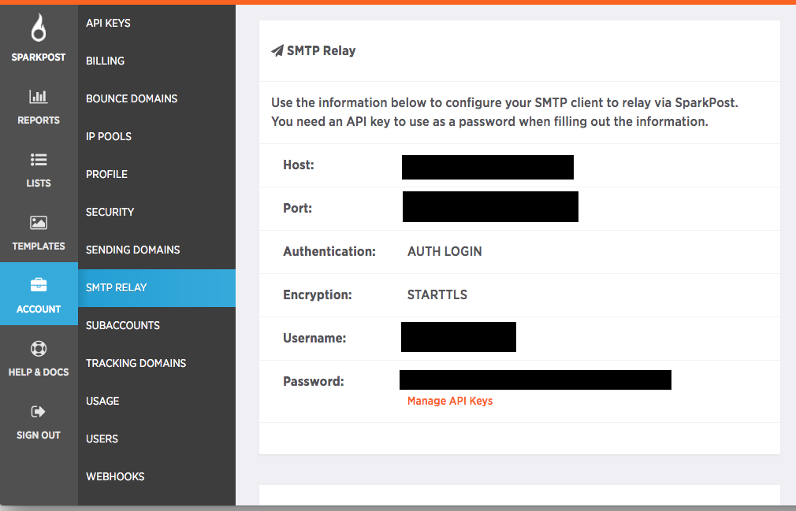
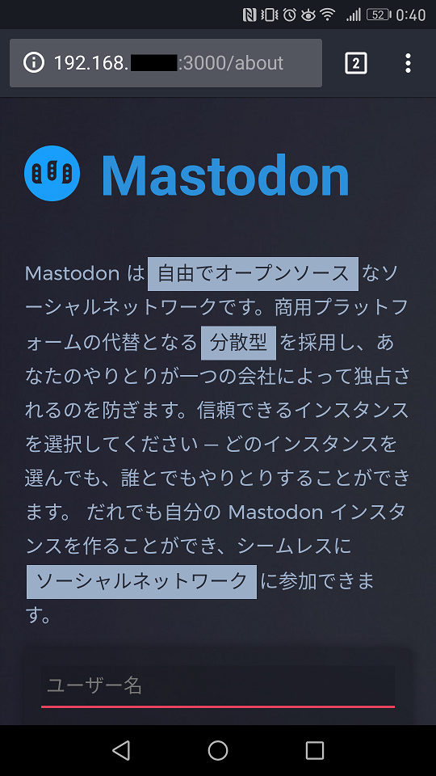

最近話題のマストドン。楽しそうですね。  
[https://github.com/tootsuite/mastodon](https://github.com/tootsuite/mastodon)

## Mastodon is...

Twitter は Twitter 社が管理していますが、Mastodon は分散型で稼働しています。

Twitter は Twitter 社が大きなサーバを用意していますが、Mastodon はオープンソースで誰でもサーバ(インスタンス)を立てることができます。

そうすると複数のサーバが立てられることになりますが、異なるサーバのユーザとコミュニケーションをとることも可能で、この繋がりを連邦と表現します。  
サーバ内限定で発言したり、連邦全てに発言したりと自由度が高いです。

日本では mstdn.jp が有名で、急激に人口を増やしています。

### メリット/デメリット

#### メリット

- 企業に縛られない

Twitter がサービス終了と言ったら有無を言わさず終わりです。何も残りません。  
また、その他言論制限がありません。あるとすれば他のサーバから国交断絶されるくらいです。[参考 togetter.com](https://togetter.com/li/1101173)

- 広告がない

有料プランも広告プランもありません。

- 効率的な情報交換

目的が設定されているインスタンスであれば、集まる人も同じ目的を持っているため効率的です。  
(例:pixiv のインスタンスは絵を自由に公開したい人が集まっています)

#### デメリット

- サーバ管理者に権利が委ねられている

アカウントを作る際にサーバを選ぶわけですが、管理者が飽きたり管理費不足でサーバを停止した場合アカウントが消えてしまいます。

## なぜラズパイでサーバを立てたいのか

そもそも mstdn.jp のように 1 つのサーバへ多くの人が集まるのって分散型のメリットを消してしまっているような気がします。  
Twitter 社の役が mstdn.jp の管理者に移っただけですよね

自分専用のサーバを立てることで、管理は自己責任になり、他者とのコミュニケーションも連邦で可能です。やめたいときはサーバを消せばいいだけです。  
つまり、分散型のメリットを大きく生かせるのではないかと思います。(先述した効率的な情報交換はできません)

そう考えると自分 1 人+α 程度であればラズパイぐらいのサイズがコスト面から考えて最適ではないかと。

ということで、やってみましょう。

## 必要なものの準備

マストドンは Docker で入れられます。

以下まとめを参考にさせていただきました。  
[http://aoi-f.hatenablog.com/entry/2017/04/16/004203](http://aoi-f.hatenablog.com/entry/2017/04/16/004203)

### 前提

raspbian 入りで外部に接続できるラズパイ 3 があること。

myDNS のサブドメインを独自ドメインにしたいのであれば、独自ドメインの DNS レコード設定で下記にすればいけると思います。

ホスト:独自ドメイン  
タイプ:cname  
コンテンツ:myDNS のサブドメイン

### git のインストール

```
sudo apt-get install git
```

### Docker と docker-compose のインストール

1 つ前の記事を参考にしてください。

### letsencrypt のインストール

無料で CA 証明書を発行できます。

```
git clone https://github.com/letsencrypt/letsencrypt.git
cd letsencrypt
./letsencrypt-auto --help
```

### nginx のインストール

```
sudo apt-get install nginx
```

### mastodon の導入

ここでめっちゃハマってました。

公式の mastodon では arm に対応していないため、自分で hypriot の alpine からビルドに挑戦し、イメージのビルドまではいったんですが、docker-compose build/ run の段階でどうにもならず死んでいました。

するとどうでしょう。もうあるじゃないですか。

[https://github.com/gilir/rpi-mastodon](https://github.com/gilir/rpi-mastodon)

[https://uehatsu.info/tech/archives/2017/04/raspberry-pimastodon.html](https://uehatsu.info/tech/archives/2017/04/raspberry-pimastodon.html)

ということで上記事を参考に進めていきます。

まずは rpi-mastodon を clone します。

```
git clone https://github.com/gilir/rpi-mastodon.git
```

続いて以下コマンドを打ちます。

```
docker-compose up -d
```

エラーが出まくりますが、「これを実行してもう 1 回チャレンジしてくれ」的なことを言われるので、ひたすら従います。(6 回くらい)

完全に服従したら以下のコマンドを 3 回繰り返し、キーを 3 つゲットします。

```
docker-compose run --rm web rake secret
```

#### .env.production の設定

.env.production.sample から.env.production を作成し、編集します。

```
cp .env.production.sample .env.production
emacs .env.production
```

変更点は以下のように

とりあえず動作を見たかったので、HTTPS 対応を false にしています。

```
# REDIS_DB=0
DB_HOST=db
DB_USER=好きなユーザ名
DB_NAME=好きなDB名
DB_PASS=好きなパス
DB_PORT=5432
# Federation
LOCAL_DOMAIN=<span style="color: #ff0000">あるなら独自ドメイン</span>
LOCAL_HTTPS=false

# Application secrets
# Generate each with the `rake secret` task (`docker-compose run --rm web rake secret` if you use docker compose)
PAPERCLIP_SECRET=先ほどのキー1
SECRET_KEY_BASE=先ほどのキー2
OTP_SECRET=先ほどのキー3

MTP_SERVER=sparkpostで入手
SMTP_PORT=587
SMTP_LOGIN=sparkpostで入手
SMTP_PASSWORD=sparkpostで入手
SMTP_FROM_ADDRESS=hoge@ドメイン (送信元用)
SMTP_AUTH_METHOD=plain
SMTP_ENABLE_STARTTLS_AUTO=true
```

SPARKPOST の情報はこのページです。  
API キーはセキュリティ上 1 回しか表示されないので注意。見落としたら再発行しましょう。



#### データベースの設定

web rake secret 後はデータベースの設定を行います。

```
docker exec -it データベースのコンテナ名 /bin/bash
bash-4.3# su - postgres
$ createuser -P 先ほどのユーザ名
Enter password for new role:
Enter it again:
$ createdb 先ほどのデータベース名 -O 先ほどのユーザ名
Ctrl + pqでコンテナから脱出
```

マイグレーションしてからアセットのコンパイルをします。

```
docker-compose run --rm web rails db:migrate
docker-compose run --rm web rails assets:precompile
```

ここまできたらとりあえずテストです。  
以下コマンドで何かの html が返って来ると思います。

```
curl localhost:3000
```

#### nginx の設定

nginx の設定を行います。設定内容は公式を流用し、example.com を自分のドメインに変えてください。

本来ならばここで証明書の取得をするべきですが、私はとりあえず HTTPS 非対応でいきました。

[https://github.com/tootsuite/documentation/blob/master/Running-Mastodon/Production-guide.md](https://github.com/tootsuite/documentation/blob/master/Running-Mastodon/Production-guide.md)

```
sudo emacs /etc/nginx/conf.d/ドメイン.conf
```

#### 起動

sudo systemctl restart nginx

起動したら他の回線から覗いてください。もしくはローカルの ip に:3000 をつけて見てください。

どうでしょう、動きましたか？

動いていないなら何かがおかしいです。もう一度確認しましょう。



**ここまで書いて何ですが、私はうまく動かないです。**

リバースプロシキがうまく作動していないのか、"ローカル IP:3000"でしか見れないです。  
外の世界から訪問すると nginx のウェルカムページが表示されます。

別記事で書きますが、docker の利用を諦めたらうまくいきました。
