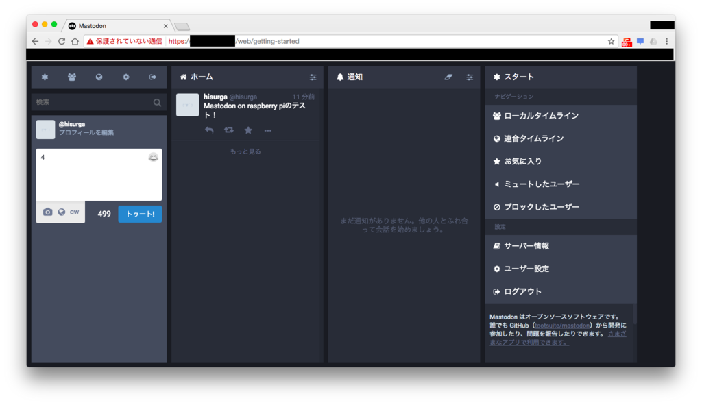

結果から書きますと、**問題なく動いています。**  
リモートフォローをほとんどやっていない低負荷状態なので、今後についてはわかりませんが、、、

## Docker を使わない選択

以前の記事では Docker を利用して mastodon しようかと考えていましたが、非力なラズパイで Docker を利用すると結構負荷がかかっている感があったので使わないことにしました。

ここに Docker あり/なしでの参考スペックが書かれてます。

お一人様インスタンスなら行けそうな気がしますね。  
[https://github.com/tootsuite/documentation/blob/master/Running-Mastodon/Resources-needed.md](https://github.com/tootsuite/documentation/blob/master/Running-Mastodon/Resources-needed.md)

## 導入手順

親切なことに without-Docker な手順もすべてドキュメントに書かれています。

書かれていない設定については、Docker 使用時と同じですので情報はたくさんあるかと思います。

[https://github.com/tootsuite/documentation/blob/master/Running-Mastodon/Production-guide.md](https://github.com/tootsuite/documentation/blob/master/Running-Mastodon/Production-guide.md)

[https://github.com/tootsuite/documentation/blob/master/Running-Mastodon/Production-guide.md](https://github.com/tootsuite/documentation/blob/master/Running-Mastodon/Production-guide.md)

基本的にドキュメント通りに進めればうまくいくのですが、ラズパイ用の修正点があるため以下にまとめます。

### ffmpeg

Debian 系がいろいろあって ffmpeg の apt-get に対応していないようですのでセルフビルドを行います。  
以下サイトを参考に進めればうまくいきます。  
[http://d.hatena.ne.jp/embedded/20151011/p2](http://d.hatena.ne.jp/embedded/20151011/p2)

### postgres

ドキュメントは以下のようになっていますが、

```
sudo apt-get install postgresql postgresql-contrib
```

私はうまくいかなかったので以下のようにしました。

```
sudo apt-get install postgresql-9.4 postgresql-contrib
```

### rbenv

ラズパイでの rbenv は以下 Qiita が参考になります。  
[http://qiita.com/u6k/items/ffb0265f6cbb58f2227d](http://qiita.com/u6k/items/ffb0265f6cbb58f2227d)

### メール認証

私はメールで認証を行いましたが、メール設定をしなくても以下コマンドでいけると思います。

```
RAILS_ENV=production bundle exec rails mastodon:confirm_email USER_EMAIL=info@example.com
```

### 管理者権限

/home/username/live に入って以下コマンドで指定 user に管理者権限を与えることができます。

```
RAILS_ENV=production bundle exec rails mastodon:make_admin USERNAME=user名
```

### お一人様インスタンス

お一人様にする予定でしたら SINGLE_MODE の設定と新規登録の無効化(admin 設定)をするといいですね。  
[http://qiita.com/sawanoboly/items/c7d6b913fd5455fb0f36](http://qiita.com/sawanoboly/items/c7d6b913fd5455fb0f36)

認証終えたらメール設定を適当にしてしまう方法もありますが。

### WEB サーバとして公開

ここを参照してください。  
[Raspberry Pi のドメインを取得して Dynamic DNS を設定する | ものづくりエクスペリメント](http://denshikousaku.net/raspberry-pi-domain-and-dynamic-dns)

サブドメインで運用するなら MyDNS からもらった無料ドメインに CNAME すればよいですね。

## とりあえず快適です



サーバ関係に疎いため穴がたくさんありそうで怖いですが、とりあえず運用できそうです。

VPS などと比べてラズパイはランニングコストが電気代だけなので、お財布に優しいです。
