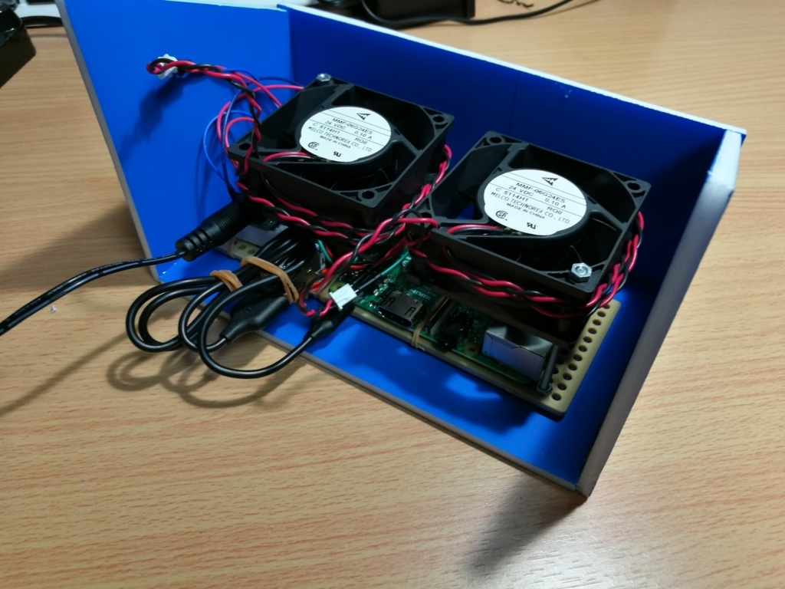

仕事から帰ってビールを飲みながら野球観戦...最高ですよね？

最近ではホーム戦なら AbemaTV とかで見られるようになり、快適に野球観戦ができるようになりました。

ただしアウェイ戦は気軽に見ることができず、1 人で一球速報を見るだけのつまらない物になってしまっています。

これを変えるために私は作りました。

## 一緒に応援してくれる物

こんな感じに動きます。ちなみにこれはホーム戦です。

<blockquote class="twitter-tweet" data-lang="ja">
ラズパイでWebスクレイピングして1人でも誰かと応援してる感を出そうとしました。<a href="https://twitter.com/hashtag/raspberrypi?src=hash">#raspberrypi</a> <a href="https://twitter.com/hashtag/DeNA?src=hash">#DeNA</a> <a href="https://twitter.com/hashtag/python?src=hash">#python</a> <a href="https://t.co/mBj8gfpjJ7">pic.twitter.com/mBj8gfpjJ7</a>
&mdash; hikiit (@hikiit18) <a href="https://twitter.com/hikiit18/status/883307609196961793">2017年7月7日</a></blockquote>

DeNA が打席に立っている時だけ人がゆらゆらと動き、バッターの応援歌が流れます。

もっと**うわあああああああああ**って揺れる予定だったんですが、、、思ってたのと違いました。

## 作り方

### Web スクレイピング

ラズパイ上で Python にて Web スクレイピングすることで試合状況を取得しています。

取得先は某有名野球速報サイト。スクレイピングは迷惑にならない程度に！

### 応援歌

Web スクレイピングで得たデータを元に、選手に合わせて応援歌を流します。再生には pygame を利用しました。  
音量があまりとれず小さくなってしまったのが残念です。

動画は作成途中の物。

<blockquote class="twitter-tweet">
ラズパイでWebスクレイピングして打席に合わせてDeNAの応援歌を流すようにしました。試合は多分一昨日のかな。 <a href="https://twitter.com/hashtag/RaspberryPi?src=hash&amp;ref_src=twsrc%5Etfw">#RaspberryPi</a> <a href="https://twitter.com/hashtag/DeNA?src=hash&amp;ref_src=twsrc%5Etfw">#DeNA</a> <a href="https://twitter.com/hashtag/Python?src=hash&amp;ref_src=twsrc%5Etfw">#Python</a> <a href="https://t.co/LmikvZ9Q5Y">pic.twitter.com/LmikvZ9Q5Y</a>
&mdash; hikiit (@hikiit18) <a href="https://twitter.com/hikiit18/status/873123418283036672?ref_src=twsrc%5Etfw">June 9, 2017</a></blockquote>

### ゆらす

24V 0.1A のファンをイラスト(by いらすとや)に当てることで応援してるっぽさをだそうとしました。

うるさい割に風が弱かった。

<blockquote class="twitter-tweet">
ラズパイ+TB6643KQ+24V電源でファンを操作 <a href="https://t.co/N8iDTqQ52N">pic.twitter.com/N8iDTqQ52N</a>
&mdash; hikiit (@hikiit18) <a href="https://twitter.com/hikiit18/status/874234462057373697?ref_src=twsrc%5Etfw">June 12, 2017</a></blockquote>

[http://akizukidenshi.com/catalog/g/gP-10435/](http://akizukidenshi.com/catalog/g/gP-10435/)

[http://akizukidenshi.com/catalog/g/gP-10435/](http://akizukidenshi.com/catalog/g/gP-10435/)

### 電子工作

ケーブルを一本にしたかったので、24Vto5V3A の降圧器を挟むことにし、

<blockquote class="twitter-tweet">
DCDC届いたー 熱くなりそう 24V to 5V3AUSB*2 <a href="https://t.co/VgQRj1l9DL">pic.twitter.com/VgQRj1l9DL</a>
&mdash; hikiit (@hikiit18) <a href="https://twitter.com/hikiit18/status/874230832289808384?ref_src=twsrc%5Etfw">June 12, 2017</a></blockquote>

24V0.1A ファン\*2 / 5V2.5A ラズパイ / 5V スピーカ

の全てを 1 つの電源でカバーしました。

それぞれのパーツの合体は、タミヤプレート + 輪ゴム  
それなりにまとまったと自画自賛しています。

### 図画工作

一番雑だけど、難しかったです。

発泡スチロールに青い紙が貼ってある板をカッターで頑張って工作しました。

楽しいですが、目分量でやったりしたのでいろいろ悲惨でしたね。

その後応援している人をテープで貼り付けて完成です。

一応 3D プリンタ前提の CAD 挑戦をしたんですが...プリント代が予算以上だったので諦めました。

## 楽しい

**これでもう 1 人じゃない！ みんなと野球応援！ 最高！！！**
