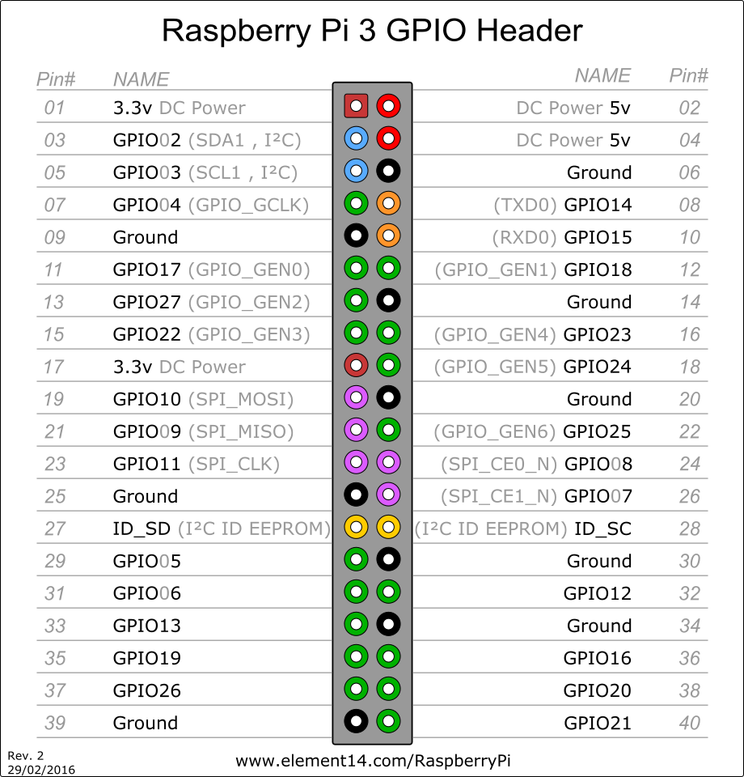

ラズパイの GPIO を利用してモータを動かします。

ピンの操作ができれば色々なことができるようになりますね。

## 環境

- Raspberry Pi3
- Python3
- [モータードライバー ＴＢ６６４３ＫＱ: 半導体(モジュール) 秋月電子通商-電子部品・ネット通販](http://akizukidenshi.com/catalog/g/gI-07688/)
- [http://akizukidenshi.com/catalog/g/gP-10435/](http://akizukidenshi.com/catalog/g/gP-10435/)

## 回路

扱う電圧が大きめのため TB6643KQ を採用しました。

Fritzing に TB6643KQ がなかったので、適当な 7 本足で代用です。


ラズパイのピン配列は以下のようになっています。



## コード

ピンの操作には wiringpi2 を使います。

raspbian 標準では python2 と wiringpi が入っていたはずですが、今回は python3 と wiringpi2 を利用しました。

```python
import wiringpi2
```

SetupGpio で初期化してから利用するピンを指定します。

当然指定するピンは GPIO です。  
0->INPUT  
1->OUTPUT  
2->PWM

```python
FANPIN = 18

def initPin():
    wiringpi2.wiringPiSetupGpio()
    wiringpi2.pinMode(FANPIN, 1)
```

後は Write で操作できます。  
1->ON  
2->OFF

```python
wiringpi2.digitalWrite(FANPIN, 1)
```

実行時は管理者権限が必要なため、sudo で実行します。  
ただし sudo だとパスが不定になってしまうようなので、絶対パスを利用します。

```
sudo /home/pi/.pyenv/shims/python /home/pi/foo.py
```

## 動き

こんな感じです。

<blockquote class="twitter-tweet"><p lang="ja" dir="ltr">ラズパイ+TB6643KQ+24V電源でファンを操作 <a href="https://t.co/N8iDTqQ52N">pic.twitter.com/N8iDTqQ52N</a></p>&mdash; hikiit (@hikiitt) <a href="https://twitter.com/hikiitt/status/874234462057373697?ref_src=twsrc%5Etfw">June 12, 2017</a></blockquote>

こうやって使えばラズパイも夏を乗り切れる。


