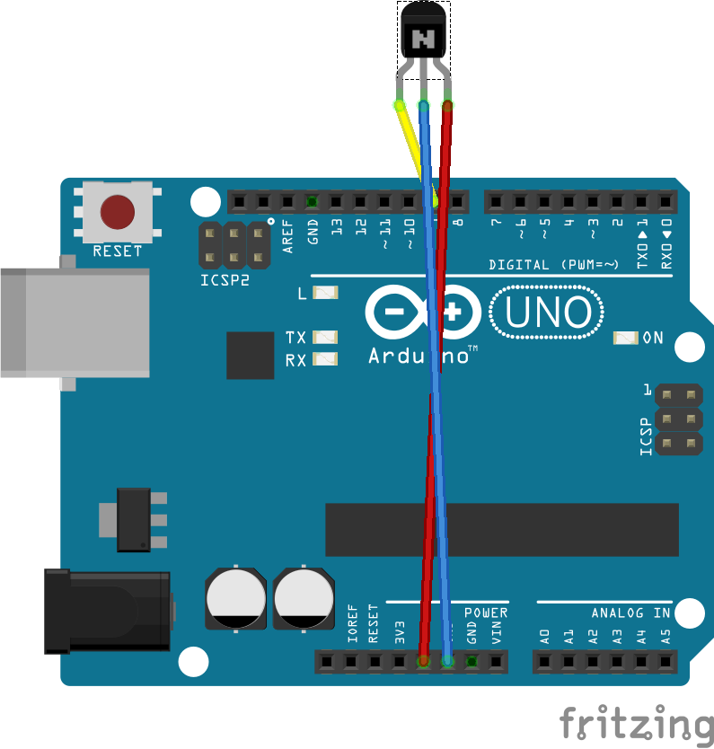

面白いものを買いました。これを使えばタッチしまくれます。  
[リレータッチボード / switch-science.com](https://www.switch-science.com/catalog/2455/)

## 必要なもの

- Arduino UNO
- リレータッチボード

## 回路

非常にシンプルです。5V 流して EN 端子に HIGH/LOW 信号流せばいいだけです。

## レッツタッチ

こんな感じになります。

<blockquote class="twitter-tweet">
スマホにタッチしてくれる奴<a href="https://twitter.com/hashtag/%E3%83%AA%E3%83%AC%E3%83%BC%E3%82%BF%E3%83%83%E3%83%81%E3%83%9C%E3%83%BC%E3%83%89?src=hash&amp;ref_src=twsrc%5Etfw">#リレータッチボード</a> <a href="https://t.co/jCuWG47N4x">pic.twitter.com/jCuWG47N4x</a>
&mdash; hikiit (@hikiit18) <a href="https://twitter.com/hikiit18/status/900008765650460672?ref_src=twsrc%5Etfw">August 22, 2017</a></blockquote>

<blockquote class="twitter-tweet">
ティッシュとかを挟まないと誤タップ？ になる。 両面テープとか良さげだと思う。
&mdash; hikiit (@hikiit18) <a href="https://twitter.com/hikiit18/status/900009413494267909?ref_src=twsrc%5Etfw">August 22, 2017</a></blockquote>
