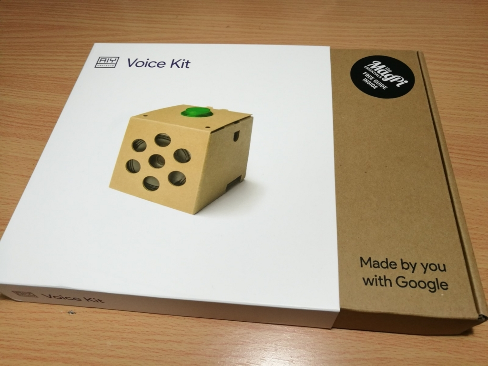
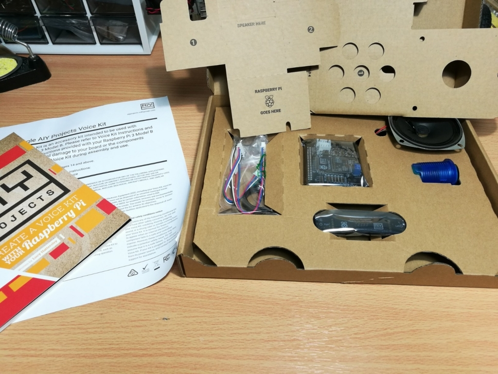
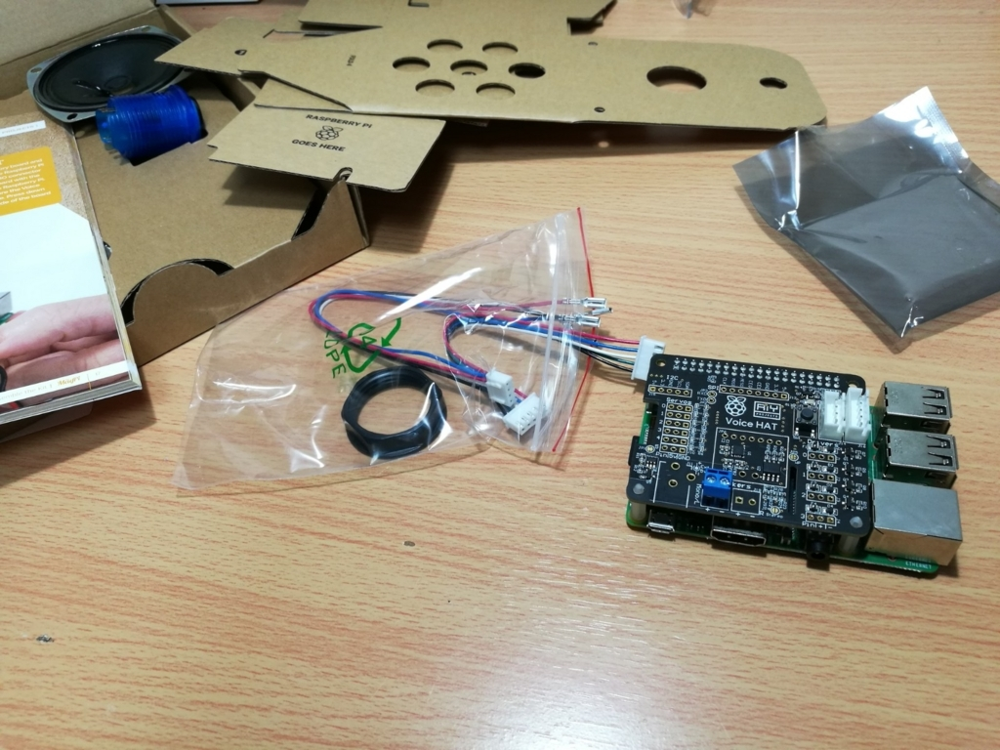
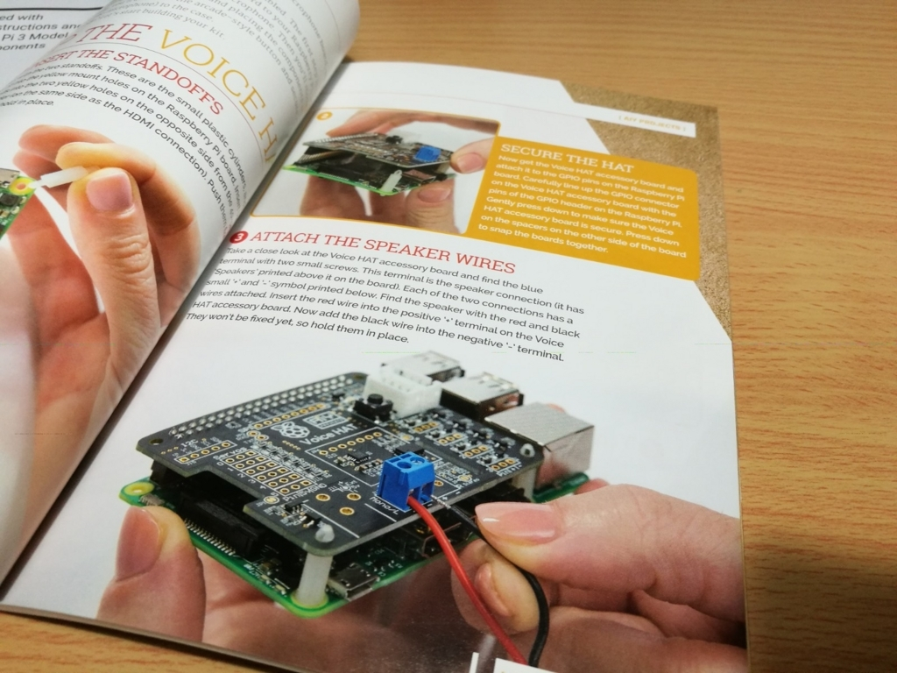
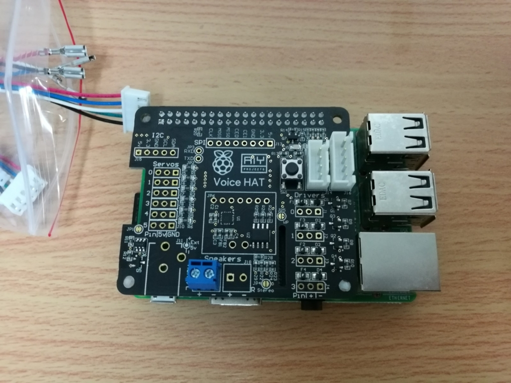
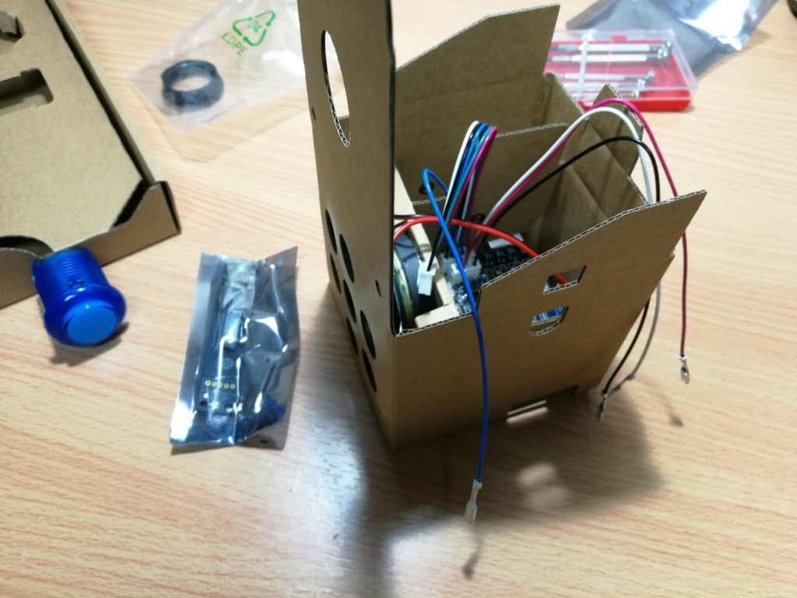
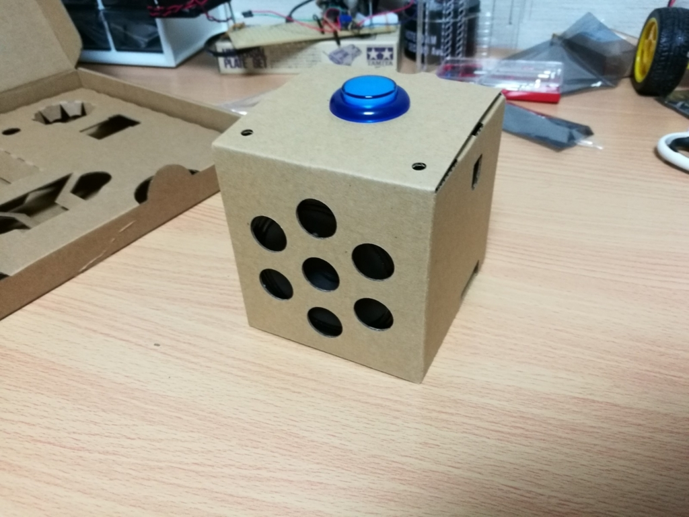
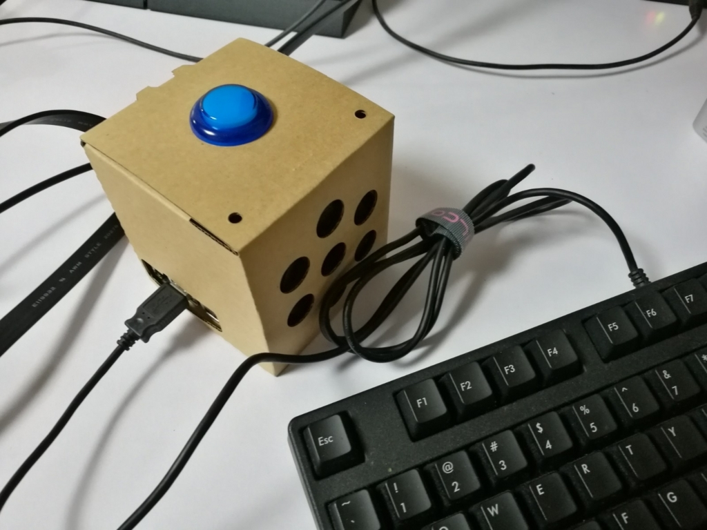

以前 Google がスマートスピーカー自作キット on ラズパイみたいのを MagPi の付録で発売したのですが、あまりの人気に買えませんでした。

ですがついにこの度再販ということで、わざわざヨーロッパから購入しました。

[Google AIY Voice Kit v2](https://shop.pimoroni.com/products/google-aiy-voice-kit-v2)[shop.pimoroni.com](https://shop.pimoroni.com/products/google-aiy-voice-kit)

## 開封

Made by you with Google いいですね。

内容物は以下の通りです。

- Voice HAT アクセサリーボード
- Voice HAT マイクボード
- スピーカー
- ボタン
- ケース用段ボール
- ケーブル類
- MagPi Essential(説明書的な)

## 作っていく

### 必要なもの

内容物以外に追加で以下のものが必要です。

- Raspberry Pi
- マイクロ SD(最低 8GB)
- キーボード(ssh までの一時的)
- マウス(一時的)
- 液晶(一時的)

つまりラズパイ標準セットを用意しろってことです。

ラズパイのバージョンは 3 だと便利な感じ。zero とかでもいけそうですけど、そのまま組み合わせるのは大変かも。

### 手順

付属の冊子に丁寧に書かれているので、その通りに進めるだけで完成します。

もちろん英語表記ですが、写真も多いので問題ゼロです。

Web でも見られます。  
[aiyprojects.withgoogle.com](https://aiyprojects.withgoogle.com/voice/#project-overview)

写真を見るとわかりますが、結構拡張性高めですね。そこのところは流石ですね。

こちらも Web で詳細見られます。  
[https://aiyprojects.withgoogle.com/voice/#makers-guide-4-1--connecting-additional-sensors](https://aiyprojects.withgoogle.com/voice/#makers-guide-4-1--connecting-additional-sensors)

#### ハード完成

躓くことなくハードが完成です。

#### ソフト

続いて肝となるソフト面ですが、これもハード同様冊子に解説が載っています。非常に丁寧に。

簡単に書くと、

Google AIY 用 OS を SD に書き込み  
↓  
細かい設定  
↓  
Google Cloud Platform(GCP)で Google Assistant を有効にする  
↓  
ラズパイ上でサンプルアプリ起動

でとりあえず Google Home が完成します。

GCP の設定をする際、冊子の解説と合わせるために言語設定を英語にしておくとわかりやすいのでおすすめです。

<blockquote class="twitter-tweet">
テスト音声 <a href="https://twitter.com/hashtag/GoogleAIY?src=hash&amp;ref_src=twsrc%5Etfw">#GoogleAIY</a> <a href="https://t.co/f4E7JhvtBl">pic.twitter.com/f4E7JhvtBl</a>
&mdash; hikiit (@hikiitt) <a href="https://twitter.com/hikiitt/status/929365857502838784?ref_src=twsrc%5Etfw">November 11, 2017</a></blockquote>

サンプルアプリを起動するとこうなります。

<blockquote class="twitter-tweet">
しゃべったあああ <a href="https://twitter.com/hashtag/GoogleAIY?src=hash&amp;ref_src=twsrc%5Etfw">#GoogleAIY</a> <a href="https://t.co/KJroCMudXi">pic.twitter.com/KJroCMudXi</a>
&mdash; hikiit (@hikiitt) <a href="https://twitter.com/hikiitt/status/929728969875656704?ref_src=twsrc%5Etfw">November 12, 2017</a></blockquote>

スマートホーム時代最大の難点は、**成果物をネットにあげる際に自分の声をお披露目しないといけないこと**だと思います。

国内販売も決まったようなので、気になる方はこの機にどうでしょう。  
[https://raspberry-pi.ksyic.com/news/page/nwp.id/65](https://raspberry-pi.ksyic.com/news/page/nwp.id/65)

#### 困ったこと

英語しか話してくれないんですが、AIY はまだ日本語対応していないのでしょうか、、、

#### ネタ

スマートホーム ver R2-D2 の完成

