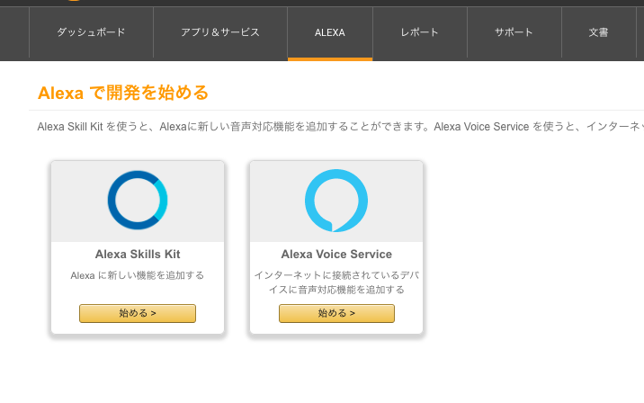
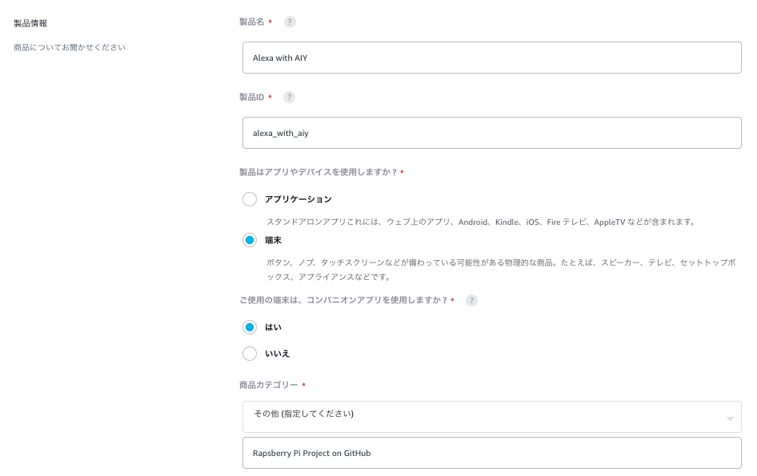
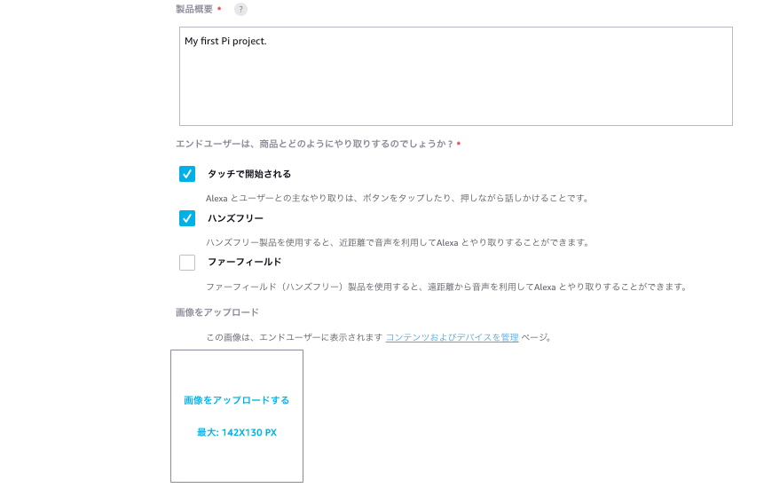
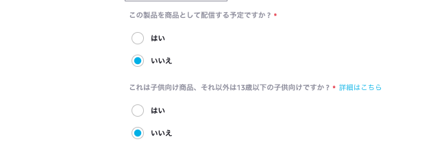
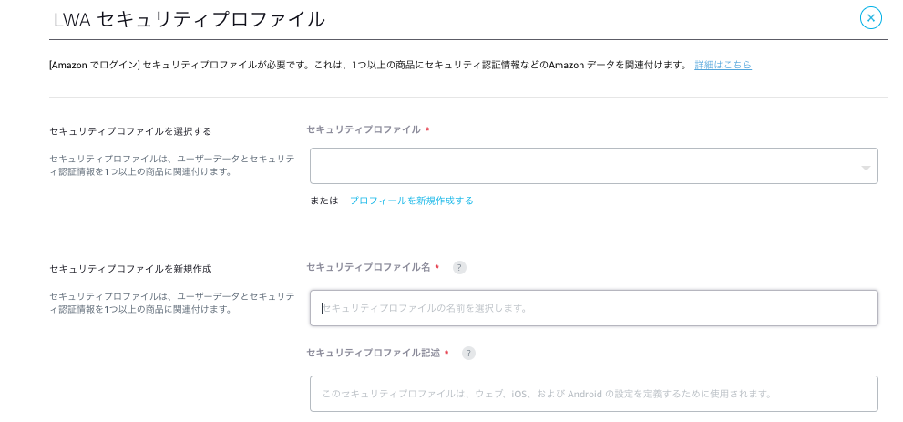
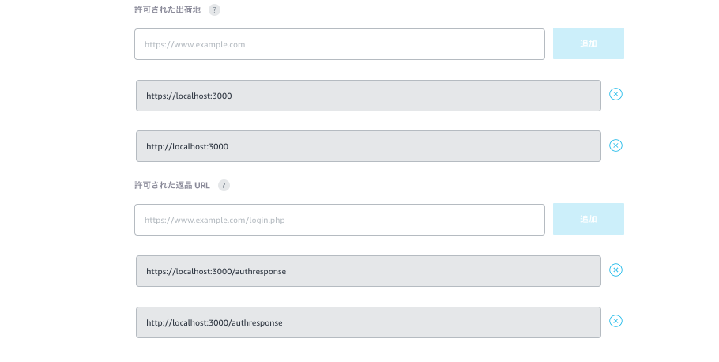
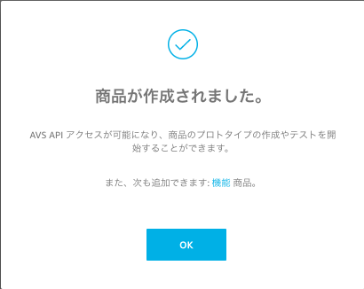
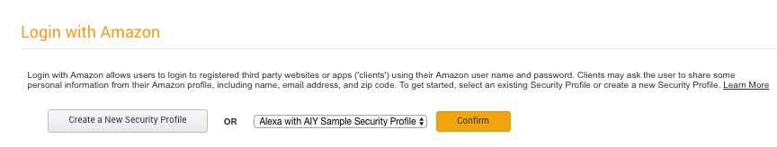

[Raspberry Pi Advent Calendar 2017 - Qiita](https://qiita.com/advent-calendar/2017/raspberry-pi)参加記事になります。

## GoogleAIY と Alexa とラズパイと

手持ちのラズパイで自由度無限大のスマートスピーカーを開発できるのは素晴らしいです。見た目もいいですし。

でももっと贅沢言えば、Google Assistant 以外でも遊んでみたい。

というか正直、Alexa と遊びたい。未だに招待メールこないし。

てことで手持ちの GoogleAIY に Alexa を乗せてみました。

### 必要なもの

- Raspberry Pi3
- GoogleAIY セット

とりあえず GoogleAIY が動けばいいってこと。

### Step1 GoogleAIY のセットアップ

Amazon の GitHub には素の Raspbian を入れろとなっていますが、今回は GoogleAIY 用 OS(といっても結局 Raspbian だと思います)を入れてください。

GoogleAIY のマニュアルに従うだけです。

### Step2 Amazon Develoer に登録

Alexa 開発を行うにはデベロッパー登録が必要です。すでに持っている方は飛ばしで。

[https://developer.amazon.com/login.html](https://developer.amazon.com/login.html)

日本語対応していますので特別問題はないと思います。

### Step3 プロファイルの作成

ダッシュボード上部のタブクリック →Alexa Voice Service "始める"をクリック



Welcome 画面で"開始する"へ

#### 製品情報の登録

遊びでも製品は製品だ！

製品名：適当  
製品 ID：適当  
アプリやデバイス：端末  
コンパニオンアプリ：はい  
カテゴリー：その他(Rapsberry Pi Project on GitHub) //多分なんでもいけるはず



概要：適当  
やり取り：タッチ, ハンズフリー  
画像アップロード：スキップ



商品としての配信：いいえ  
子供向け：いいえ



#### セキュリティプロファイルの作成

"プロフィール新規作成"でプロファイルを作成します。  
プロファイルの名前、概要については適当に"Sample Security Profile"とかでいいんじゃないでしょうか。



作成するとセキュリティプロファイル ID とかいろいろでてきますので、

"許可された出荷地"

```
http://localhost:3000
https://localhost:3000
```

"許可された返品 URL"

```
http://localhost:3000/authresponse
https://localhost:3000/authresponse
```



それぞれ上記 URL を追加、同意して完了です。



プロファイルを有効にするために、[https://developer.amazon.com/lwa/sp/overview.html](https://developer.amazon.com/lwa/sp/overview.html)で選択有効しておきます。



プライバシーポリシー URL は適当に[http://ex.com](http://ex.com)とかでいいです。

これで`Client ID`と`Client Secret`を参照できます。

### Step4 Sample アプリを clone

[https://github.com/alexa/alexa-avs-sample-app](https://github.com/alexa/alexa-avs-sample-app)

raspberry pi の操作です。

```
cd Desktop
git clone https://github.com/alexa/alexa-avs-sample-app.git
```

続いて `Product ID` `Client ID` `Client Secret` を自分のものに更新します。

```
cd ~/Desktop/alexa-avs-sample-app
emacs automated_install.sh
```

記入場所はファイルの最上部ですのでわかりやすいと思います。

### Step5 インストール用スクリプトを走らせる

```
cd ~/Desktop/alexa-avs-sample-app
. automated_install.sh
```

基本は YES

```
which locale
1) en-USを選択
```

```
3.5mm jack or HDMI
2)HDMIを選択
```

これ多分 GoogleAIY 用 OS だとデフォルトが AIY のスピーカーになってるんだと思います。  
なので HDMI と設定しても問題なく AIY のスピーカーから音声が流れました。

```
want to enable "Alexa" Wake Word Detection
YES (めっちゃ長い)
```

### Step6 デモ準備

ターミナルを 3 つ開きましょう。

#### Terminal1

```
cd ~/Desktop/alexa-avs-sample-app/samples
cd companionService && npm start
```

`Listening on port 3000`となればオッケーです。

#### Terminal2

```
cd ~/Desktop/alexa-avs-sample-app/samples
cd javaclient && mvn exec:exec
```

しばらくして以下のようなメッセージが出たら Yes.

```
Please register your device by visiting the following URL in a web browser and following the instructions: https://localhost:3000/provision/hogehoge. Would you like to open the URL automatically in your default browser?
```

たぶんプライバシーエラーが出ると思うので、  
Advanced→Proceed to localhost(unsafe)をクリックです。

すると Amazon のログイン画面が出るので、Developer 用アカウントでログイン。

Okay 押したら "セキュリティプロファイルを渡すよ" と表示されるので信じて Okay.

`device tokens ready`となれば成功なので、ブラウザから離れて`Login to Register`ウインドウの OK をクリック。

##### この時点でとりあえず Alexa は試せると思います

マイクのアイコンをクリックして話しかけると、、、しゃべるぞ。

<blockquote class="twitter-tweet"><p lang="pt" dir="ltr">Alexa on GoogleAIY <a href="https://twitter.com/hashtag/GoogleAIY?src=hash&amp;ref_src=twsrc%5Etfw">#GoogleAIY</a> <a href="https://twitter.com/hashtag/Alexa?src=hash&amp;ref_src=twsrc%5Etfw">#Alexa</a> <a href="https://t.co/BgMiWwZH1l">pic.twitter.com/BgMiWwZH1l</a></p>&mdash; hikiit (@hikiitt) <a href="https://twitter.com/hikiitt/status/938785224334352384?ref_src=twsrc%5Etfw">December 7, 2017</a></blockquote>

#### Terminal3

`kitt_ai` か `sensory`とかいうサードパーティー製エンジンを利用して

Alexa!!!

って呼びかけたら反応してくれるようにするらしいんですが、GitHub のコマンドそのままを打っても上手くいかないので少し調べる必要がありそうです。

### ようこそ...『Alexa の世界へ』へ...

(kitt_ai を除いて)特に苦労することなく導入できました。GoogleAIY 用 OS といっても標準 OS とそんなに変わらないので、結局 AlexaSDK の手順書通りでいいってことですね。

- なんとなく Alexa のほうが好きだ。でも招待メールはまだこない。
- 自作で自由度上げたい。
- GoogleAIY を買ってしまった。

そんなあなたへ、いかがでしょうか。

#### 余談

GoogleAIY のスピーカー、音がとても大きいです。

ラズパイ側のマスターの音量下げても、alsamixer の音量下げても全然変わらないです。なぜだ。
