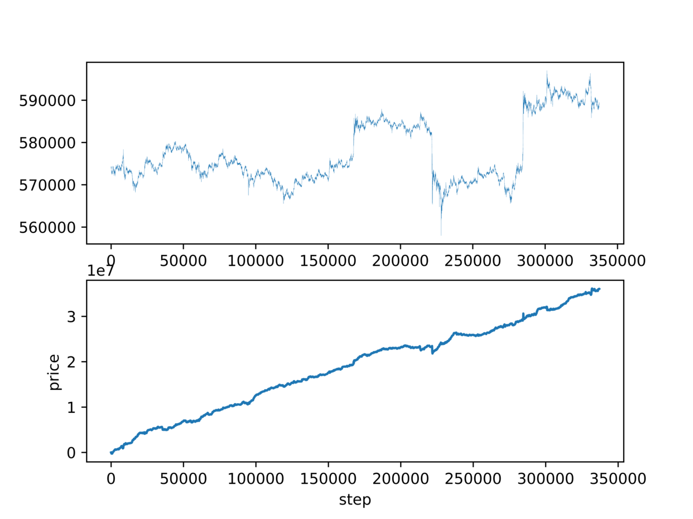
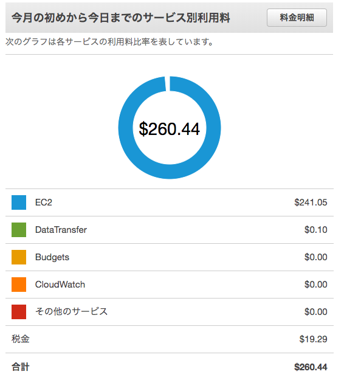

学生時代にも ML 系について勉強していましたが、久々に 1 から始めてみようと思い立ちました。  
しかし勉強したところで業務に利用することもないし、もちろんお金になりません。

だったら、ビットコインの価格予想で儲けることができればモチベも上がるんじゃないかと。 ということで頑張ってみます。

先に結果を記載しますと、 **一見すると予想はいい感じだけど、いざ取引してみると爆損です。**

一見するといい感じのグラフ



少しでも興味のある方への手助けになれば幸いですが、私自身かなり浅い所にいるのは自覚しているのでご承知おきください。

## 使用するもの

今回は `keras` と `keras-rl` を利用します。なぜなら"私の"学習コストが安いからです。

エージェントにはたくさん学習させますが、私の学習時間は減らしたかったので。社会人は時間がないのです。勉強しながら働ける職場を熱望します。

価格予想には強化学習を利用します。

### Keras Keras-rl

Keras は簡単に機械学習できるライブラリです。機械学習についての基礎は、良くも悪くもいらないです。

Keras-rl はそれをさらに簡単にしたライブラリです。「なんでもいいから機械学習させてくれ」って方におすすめです。  
[keras.io](https://keras.io/ja/)

### ビットコイン

ビットコイン FX は 24 時間稼働していますし、ボラティリティが大きいので成果が確認しやすいため、今回の実験対象としました。

私自身は少しだけアカウント取ってみただけでトレード知識はほとんどありません。

## 環境構築

keras を用意したところで、まだ実験を始めることはできません。

機械学習には学習させるためのデータが必要です。

### データ取得

FX 予想に使われるデータとしては、時系列データである OHLC が一般的ですね。

OHLC は過去のデータを簡単に取得できるので、学習データを集めやすいのが大きいメリットです。

しかし、私は下記仮定を立てました。

1.  価格情報は学習データの中でユニークな値になりやすいのではないか
2.  ユニークな値で学習すると Agent が安易に学習してしまうのではないか

その結果、 **OHLC で学習しても使い物にならないのではないか** (過学習になりやすいのではないか)と予想を立てました。  
※過学習=データの丸暗記みたいなもの。汎用性がない。

対策として OHLC を値そのままで使わず、増減率にするなどのアイデアもありましたが、今回は板情報から"板の厚み"を学習データにすることを考えました。

そこに価格情報は含めず、「midprice から x 円離れたところの厚み」を利用します。

これがいい選択である確信なんてありません。ですが、何事もトライアル&エラーです。

#### 板情報の取得

bitFlyer API で板情報を取得して `sqlite` で保存します。

保存方法は下記を参考にしました。  
[https://qiita.com/onhrs/items/b64144cd63cf7484a35a](https://qiita.com/onhrs/items/b64144cd63cf7484a35a)  
[https://note.mu/akagami/n/nda6159c7b8ad](https://note.mu/akagami/n/nda6159c7b8ad)

コード全文は上記有料 note を改変したものですので載せるのは控えます。  
累積方法は以下のコードを参考にしてください。

```python
# 欲しい深さによって変更
DEPTH = [10, 20, 30, 50, 80, 130, 210, 340, 550, 890, 1440, 2330, 3770, 6100, 9870]
askvol = [0, 0, 0, 0, 0, 0, 0, 0, 0, 0, 0, 0, 0, 0, 0]
bidvol = [0, 0, 0, 0, 0, 0, 0, 0, 0, 0, 0, 0, 0, 0, 0]

for i in range(len(DEPTH)):
    for ask in board['asks']:
        if DEPTH[i] < ask['price'] - board['mid_price']:
            break
        else:
            askvol[i] += ask['size']

    for bid in board['bids']:
        if DEPTH[i] < board['mid_price'] - bid['price']:
            break
        else:
            bidvol[i] += bid['size']
```

私はだいたい 1 週間を 1 つのファイルに保存していましたが、データベースが大きくなっていくと徐々に処理が重くなっていくので注意が必要です。

### 計算リソースの確保

効率的に ML を進めるには計算能力のある環境が必要です。

そこで今回は AWS の EC2 インスタンス `p2-xlarge` と、AMI `Deep Learning AMI (Ubuntu)` の組み合わせで環境を作ります。

AWS アカウントについての詳細は割愛しますが、インスタンスの作成で下記 AMI を選びましょう。


インスタンスに接続すると「環境を選べ」みたいなメッセージが出ますが、`source activate tensorflow_p36`を実行しましょう。

`p2.xlarge` のコスパはマシンのスペックから考えるといいんですが、消し忘れるととても痛いです。



価格予想で一攫千金を狙うより、素直に節約した方がお金は貯まると思います。

もちろん、モデルが複雑でない限りはハイスペックはいらないです。

私は途中からモデルをシンプルにしたので、t2.midium の CPU で計算させていました。お手元の mac book でもいけますが、他の作業ができなくなるのでやめておきましょう。

## 実装と実験

とにかく改変 & 改変で作ったので、色々と非効率だったりすると思います。

整備できてなくてお恥ずかしいですが、GitHub ならこちら。  
[github.com](https://github.com/hikiit/DQNBot)

### DQNBot

- Agent には 3 つの選択肢 "BUY/SELL/STAY(何もしない)" を与える
- 与える状況は "一定間隔の板の厚さ"
- BUY -> (STAY) -> SELL もしくはその逆の順番で action が選択された時、その差額を報酬として与える

#### 実装 1

`gist:1c45a9e208ffeeb654a7466ef61820ed`

#### 結果 1

**「Agent はノーポジとガチホを覚えた！！！」**

何十万ステップもトレーニングさせると、「これ取引するより何もしないほうがいいよね」「最初に買ってガチホが一番だよね」と考えるようになってしまいました。

逆に学習を少なくしても、ひたすらに負け続けていました。

#### 実装 2 LSTM を導入する

モデルを変えて LSTM を導入してみます。

「実はこの板の厚みの変化って長期的に見る必要があるんじゃないか」と仮説を立て、LSTM を選定しました。

ネットワーク定義を以下に変えてみます。

```python
# DQNのネットワーク定義
model = Sequential()
model.add(LSTM(units=512, return_sequences=True, input_shape=input_shape))
model.add(Dropout(dropout))
model.add(LSTM(units=512, return_sequences=False))
model.add(Dropout(dropout))
model.add(Dense(units=nb_actions))
```

#### 結果 2

**「Agent はノーポジとガチホを覚えた！！！」**

変わらないですね。

#### 反省と仮説

- 1step(1sec)毎に 3 択を与えるって Agent にとってとても難しいことではないのか？  
  -> ゲームを攻略できる DQN があるくらいだからいけると思いますが...

- シンプルにパラメータや考え方が悪いんじゃないか？

- 一定期間後に上か下か予想させる方が効率よく学習できるんじゃないか？  
  -> **やってみよう**

### DQNBot_Label

- Agent には 3 つの選択肢 "BUY/SELL/STAY(何もしない)" を与える
- 与える状況は "一定間隔の板の厚さ"
- BUY or SELL が選択された時、一定期間後の midprice との差額を報酬として与える
- Label って名前に特に意味はない

報酬の与え方も少し工夫します。  
報酬をシンプルにすることで、汎用性を高めることが目的です。

- 一定額以上のプラス差額 "報酬 1"
- 一定額未満のプラス差額 "報酬 0"
- マイナス差額 "報酬-1"

#### 実装

`gist:3352e5cea083aaa89e2be59f06f3a039`

#### 結果

train データそのままを test してたところ、かなり儲けているようです。(パラメータや学習回数は記録できていません。。)

青が SELL 赤が BUY


しかし他のデータセットで test したところ、惨敗です。


このモデルで bitFlyer の Bot も作ってみましたが、取引の回数が少なく、十分なデータを集められませんでした。(STAY ばかり選択される)

#### 反省

- 汎用性がない どうやら過学習になっているように見受けられる
- 急騰/急落時にリバを期待して逆張りしていくっぽい
- もっとガンガン取引してスキャって欲しい

#### 対策

以下の案で考えています。まだ検証は進められていません。

- 汎用性がない  
  -> モデルをシンプルにする dropout を高めに設定する 学習データをもっと増やす

- 急騰/急落時にリバを期待して逆張りしていくようだ  
  -> モデルをシンプルにする

- もっとガンガン取引して欲しい  
  -> モデルをシンプルにする action を BUY/SELL の 2 択にする

## まとめ

「DQNBot で儲けられたのか」については、

**「今の所、儲けられていません」** が回答になります。

バックテストでこの状況では、確実に実環境では大損します。実環境ではスプレッドなども考慮しなければならず、それを賄えるほどの報酬を安定して出さなければ行けません。

過学習を乗り越えた先に何かがあると信じて、暇を見つけて進めたいと思います。上手くいった日には、続編として書くかもしれません。

### 最初のグラフ

最初に載せたグラフは action を BUY/SELL の 2 択にして 1 秒毎 1 分先の価格予想した結果です。

めちゃくちゃいい感じに伸びていますが、これも過学習でした。


### 参考にさせていただいたサイト

[DQN で機械学習した人工知能が Bitcoin をシストレして月 700 万円儲けるまでの話（失敗） - Qiita](https://qiita.com/dogwood008/items/18905088ad8d9d4bf672)  
[Deep Q-Learning で FX してみた](https://www.slideshare.net/JunichiroKatsuta/deep-qlearningfx)  
[機械学習やディープラーニングで FX 予測をする際に超参考になる記事まとめ](http://www.algo-fx-blog.com/fx-ml-trading-existing-projects/)  
[https://ai-kenkyujo.com/2018/10/16/kagakushu/](https://ai-kenkyujo.com/2018/10/16/kagakushu/)  
[\[Python\] Keras-RL で簡単に強化学習(DQN)を試す - Qiita](https://qiita.com/inoory/items/e63ade6f21766c7c2393)
