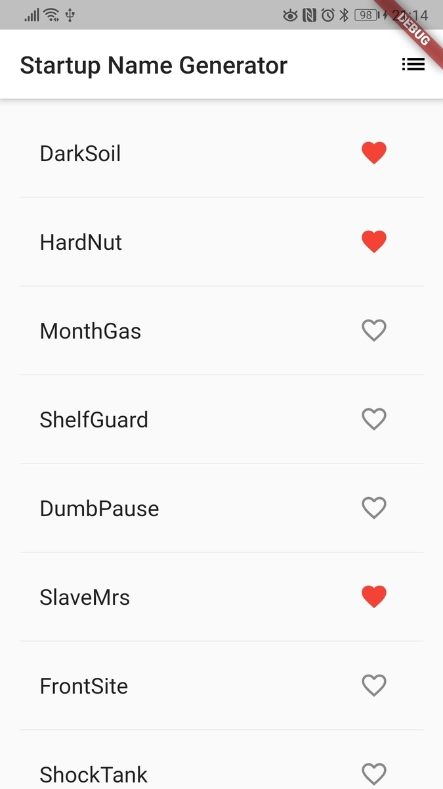

codelabs の「Write Your First Flutter App, part 2」ではタップを ListTile 全体で取得していますが、Tile 全体のタップではなく Icon のタップだけを認識するようにします。  
[codelabs.developers.google.com](https://codelabs.developers.google.com/codelabs/first-flutter-app-pt2/#4)



## 結論

`IconButton`を使う。

### 問題

codelabs のサンプルアプリでは、タップイベントを`onTap`で取得しています。

`onTap`は ListTile へ結びついているため、Tile のどこをタップしてもハートの色が変化します。

これだと Tile 内でタップイベントを分けたい場合は困ります。

```dart
Widget _buildRow(WordPair pair) {
  final alreadySaved = _saved.contains(pair);
  return ListTile(
    title: Text(
      pair.asPascalCase,
      style: _biggerFont,
    ),
    trailing: Icon(
      alreadySaved ? Icons.favorite : Icons.favorite_border,
      color: alreadySaved ? Colors.red : null,
    ),
    onTap: () {
      setState(() {
        if (alreadySaved) {
          _saved.remove(pair);
        } else {
          _saved.add(pair);
        }
      });
    },
  );
}
```

### 解決策

`trailing`に表示するものを`Icon`ではなく`IconButton`にすることで簡単に解決できます。

具体的には`trailing`へ`IconButton`を指定し、`IconButton`の中で`Icon`とタップイベント取得用の`onPressed`を記載します。

```dart
  Widget _buildRow(WordPair pair) {
    final bool alreadySaved = _saved.contains(pair);
    return ListTile(
      title: Text(
        pair.asPascalCase,
        style: _biggerFont,
      ),

      trailing: IconButton(
        icon: Icon(alreadySaved ? Icons.favorite : Icons.favorite_border,
            color: alreadySaved ? Colors.red : null),
        onPressed: () {
          setState(() {
            if (alreadySaved) {
              _saved.remove(pair);
            } else {
              _saved.add(pair);
            }
          });
        },
      ),
    );
  }
```

シンプルに、アイコンをボタンにすればいいよねってことです。

試せていませんが `Container` でウィジェットを分けてからクリックリスナーを付けることもできると思います。

### 参考

ListTile についてはこのページがわかりやすいです。  
[ListTile class - material library - Dart API](https://api.flutter.dev/flutter/material/ListTile-class.html)
