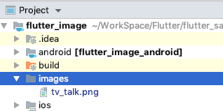

アプリ内に登録した画像(assets に登録した画像)を表示する方法です。

## 画像の表示

Flutter で画像を表示するにはいくつかの方法がありますが、今回はアプリ内にあらかじめ画像を保管した画像を表示する方法です。

### 1. 画像を保存するフォルダの作成

Flutter プロジェクト直下にフォルダを作成し、その中へ画像を保存します。

今回はファイル名を images としましたが、他のフォルダ名にしても大丈夫です。



Android Studio 上では思った通りにフォルダを作成できなかったので、私はターミナル上で作成しました。

### 2. pubspec.yaml の編集

pubspec.yaml の`flutter:`に画像を追加します。

```
flutter:
  uses-material-design: true

  assets:
    - images/tv_talk.png
```

下記のように書くことで、フォルダごと登録することもできます。

```
flutter:
  uses-material-design: true

  assets:
    - images/
```

編集後は IDE 右上に出てくる`packages get`で反映させることを忘れないようにしてください。

### 3. 画像の表示

画像は`Image.asset`で画像を表示できます。

```dart
Image.asset('images/tv_talk.png'),
```

## コード全体

シンプルな画像を表示するだけのアプリです。

```dart
import 'package:flutter/material.dart';

class MyImagePage extends StatefulWidget {
  MyImagePage({Key key, this.title}) : super(key: key);
  final String title;

  @override
  _MyImagePageState createState() => _MyImagePageState();
}

class _MyImagePageState extends State<MyImagePage> {
  @override
  Widget build(BuildContext context) {
    return Scaffold(
      appBar: AppBar(
        title: Text(widget.title),
      ),
      body: Center(
        child: Image.asset('images/tv_talk.png'),
      ),
    );
  }
}
```

プロジェクトの全体像は GitHub に載せています。

https://github.com/hiknot/flutter-samples/tree/master/flutter_image

## 公式リファレンス

https://api.flutter.dev/flutter/widgets/Image-class.html
