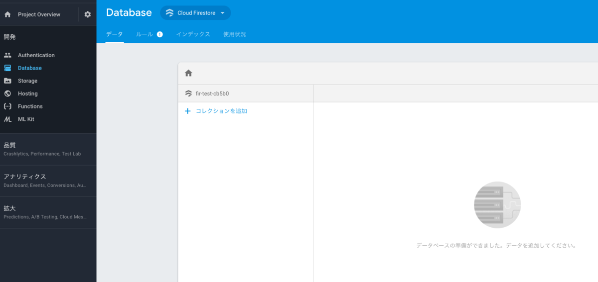
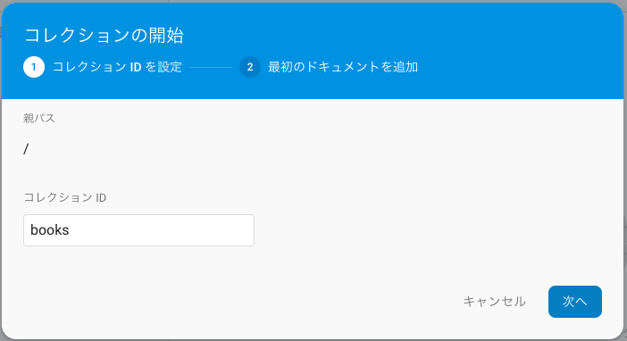
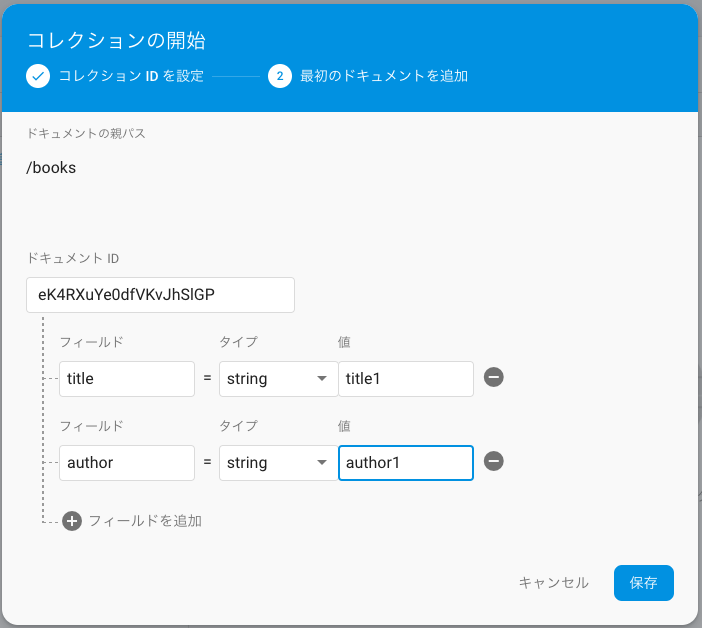
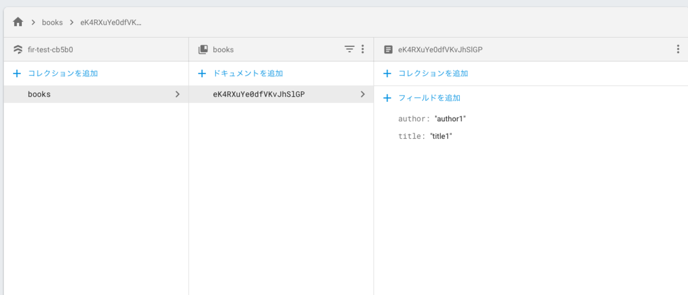
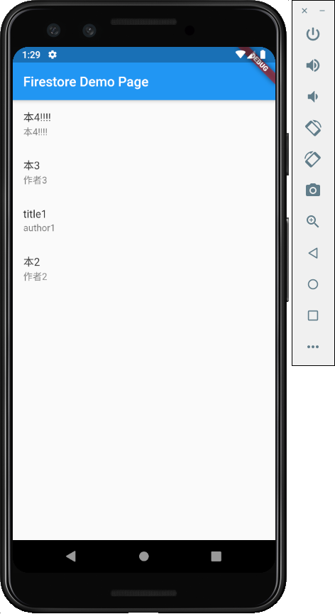
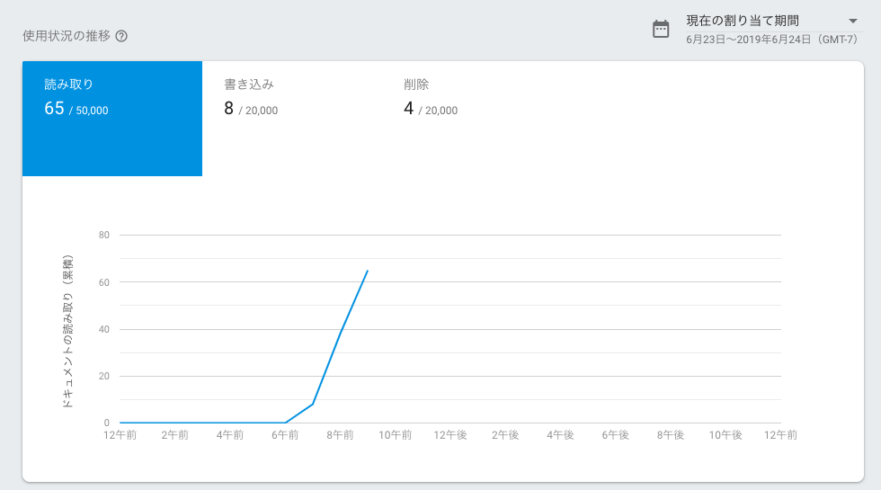

Flutter で Firestore を扱ってみます。

## Firebase の導入

Flutter のプロジェクトに Firebase を対応させます。対応手順は公式で丁寧に解説されています。

手順に従ってステップ 4 まで進めましょう。  
[https://firebase.google.com/docs/flutter/setup?hl=ja#add_flutterfire_plugins](https://firebase.google.com/docs/flutter/setup?hl=ja#add_flutterfire_plugins)

## Firestore の導入

`pubspec.yaml`へ下記のように指定します。  
その際、最新のバージョンは[pub.dev](https://pub.dev/packages/cloud_firestore#-installing-tab-)から確認します。

なお「Firebase の導入」で使った公式ドキュメントには`firebase_core: ^0.2.5`と記載されていますが、最新の `cloud_firestore` では `0.4.0` を要求されますので、書き換える必要があります。(2019/6/24 の情報)

```
dependencies:
  flutter:
    sdk: flutter
  firebase_core: ^0.4.0
  cloud_firestore: ^0.12.5+2
```

下記のように import すれば使用することができます。

```dart
import 'package:cloud_firestore/cloud_firestore.dart';
```

### Firestore データベースの作成

プロジェクト毎の Firebase コンソール > Firestore から Firestore データベースを作成します。中身は空で大丈夫です。

### サンプルを試す

公式のサンプルコードほぼそのままで試してみます。

アプリ起動時は何も表示されません。


Firebase コンソールからコレクションを追加してみます。



コレクション ID を`books`にします。



ドキュメントに`title`と`author`を記載します。  
ID は特に理由がなければ自動 ID で問題ありません。



データベースにコレクションとドキュメントが追加されました。



アプリ上では、追加された瞬間にサンプルアプリへ情報が反映されました。


ドキュメントを追加しても更新されます。



コードは以下になります。

```dart
import 'package:flutter/material.dart';
import 'package:cloud_firestore/cloud_firestore.dart';

void main() => runApp(MyApp());

class MyApp extends StatelessWidget {
  @override
  Widget build(BuildContext context) {
    return MaterialApp(
      title: 'Firestore Demo',
      theme: ThemeData(
        primarySwatch: Colors.blue,
      ),
      home: MyHomePage(title: 'Firestore Demo Page'),
    );
  }
}

class MyHomePage extends StatefulWidget {
  MyHomePage({Key key, this.title}) : super(key: key);
  final String title;

  @override
  _MyHomePageState createState() => _MyHomePageState();
}

class _MyHomePageState extends State<MyHomePage> {
  @override
  Widget build(BuildContext context) {
    return Scaffold(
      appBar: AppBar(
        title: Text(widget.title),
      ),
      body: StreamBuilder<QuerySnapshot>(
        stream: Firestore.instance.collection('books').snapshots(),
        builder: (BuildContext context, AsyncSnapshot<QuerySnapshot> snapshot) {
          if (snapshot.hasError) return new Text('Error: ${snapshot.error}');
          switch (snapshot.connectionState) {
            case ConnectionState.waiting:
              return new Text('Loading...');
            default:
              return new ListView(
                children:
                    snapshot.data.documents.map((DocumentSnapshot document) {
                  return new ListTile(
                    title: new Text(document['title']),
                    subtitle: new Text(document['author']),
                  );
                }).toList(),
              );
          }
        },
      ),
    );
  }
}
```

コンソールでは使用状況も容易に把握できます。



## 参考

[Flutter アプリに Firebase を追加する  |  Firebase Documentation](https://firebase.google.com/docs/flutter/setup?hl=ja#add_flutterfire_plugins)

[cloud_firestore | Flutter Package](https://pub.dev/packages/cloud_firestore#-readme-tab-)
