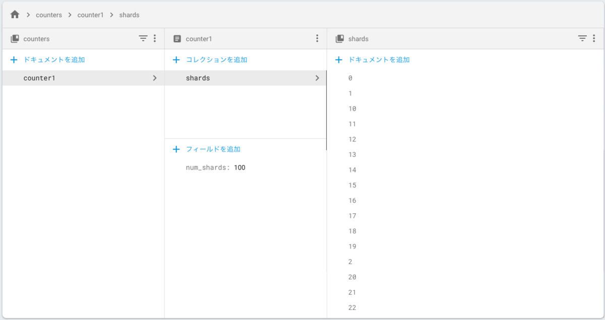
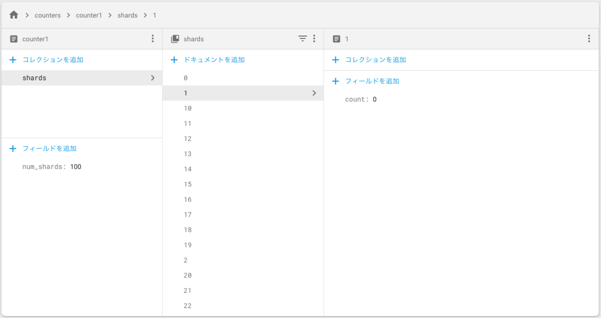

分散カウンタを簡単なカウントアップアプリで試してみます。

## 分散カウンタ

多くのアプリでは、いいね数やフォロワー数のためにカウントアップが必要です。  
しかし Firestore では、制限上 1 つのドキュメントにつき 1 秒に 1 回しか更新することができません。

そこで分散カウンタを利用します。

1 つのドキュメントにつき 1 秒に 1 回しかできないなら、ドキュメントをたくさん作ってしまえばいいのです。

### 具体的な方法

1. カウントアップ用のコレクションを作成します。
2. カウントアップ時はランダムにコレクション内のドキュメントを 1 つ選び、フィールドの値をインクリメントします。
3. カウント取得時は、コレクション内のドキュメントの値を合計すれば OK です。

### 簡単なサンプル

Shards 数 100 で 100 回インクリメントしたところ、96 まで上がりました。  
4 回ほど失敗しているようです。

Shards 数 500 でも試したら 100 まで到達しました。

スループットは Shards 数に比例しますが、  
あまりに Shards 数を増やすとそれだけ Firestore のコストがかかるので難しいところです。

今回のコレクションとドキュメントの構成はこれです。

今回の実験コードはこちらです。

`gist:2f31f537064155daa37c23e9e5238066`

## 参考にさせていただいたサイト

[分散カウンタ  |  Firebase Documentation](https://firebase.google.com/docs/firestore/solutions/counters?hl=ja)

[Firebase Cloud Firestore の Transaction について考える - Qiita](https://qiita.com/1amageek/items/2eff436fb69bea5875ea)
