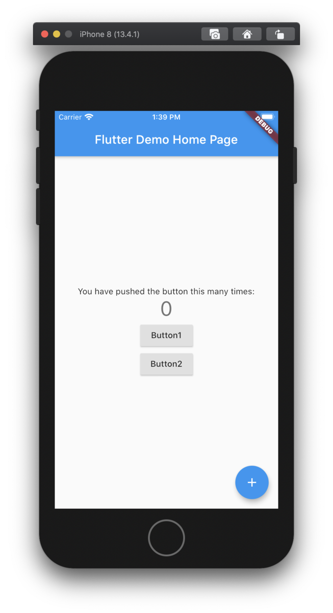
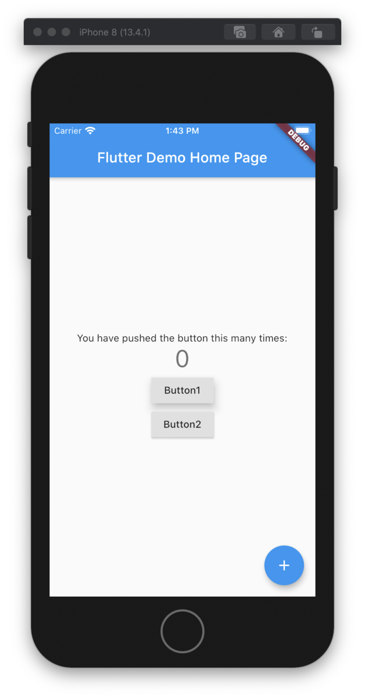

ほとんどの Widget に用意されている elevation プロパティですが、これは z 軸方向への階層を表しています。

```dart
floatingActionButton: FloatingActionButton(
    elevation: 2,
    onPressed: _incrementCounter,
    tooltip: 'Increment',
    child: Icon(Icons.add),
    ),
```

「マテリアルデザインでは z 軸方向が存在し、パーツとパーツの物理的な重なり合いでデザインされる」  
といった話はよく聞くと思いますが、elevation はその z 軸を示します。

### 例

わかりやすくするため、2 つ並んだ RaisedButton があるとします。elevation は指定していないので初期値です。

```dart
RaisedButton(
    child: Text("Button1"),
    onPressed: () {},
),
RaisedButton(
    child: Text("Button2"),
    onPressed: () {},
),
```



elevation を 10 にするとこうなります。

```dart
RaisedButton(
    elevation: 10,
    child: Text("Button1"),
    onPressed: () {},
),
RaisedButton(
    child: Text("Button2"),
    onPressed: () {},
),
```



## 参考にさせていただいたサイト

[elevation property - Material class - material library - Dart API](https://api.flutter.dev/flutter/material/Material/elevation.html)
